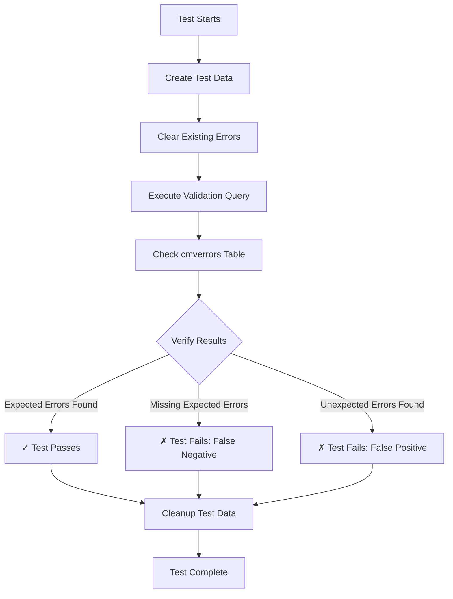

# Validation Testing Framework

Comprehensive testing system for validation queries stored in the `sitespecificvalidations` table.

## Overview

This framework provides automated testing for **all 15 validation queries** that detect data quality issues in the ForestGEO database. The system:

1. ✅ Creates isolated test data for specific validation scenarios
2. ✅ Executes validation queries against test data
3. ✅ Verifies correct errors are flagged in `cmverrors` table
4. ✅ Detects false positives (measurements incorrectly flagged)
5. ✅ Detects false negatives (measurements that should be flagged but aren't)
6. ✅ Automatically cleans up test data after each test

## Quick Start

### Run All Validation Tests

```bash
npm run test:validations
```

### Run Specific Validation Tests

```bash
# Test only validation 6 (Date Outside Census Bounds)
npx vitest tests/validation-framework/run-validation-tests.test.ts -t "Validation 6"

# Test only validation 15 (Abnormally High DBH)
npx vitest tests/validation-framework/run-validation-tests.test.ts -t "Validation 15"
```

### Run Single Test Scenario

```bash
npx vitest tests/validation-framework/run-validation-tests.test.ts -t "Date Before Census Start"
```

## Configuration

Tests require database connection. Configure via environment variables:

```bash
# .env.local
AZURE_SQL_SERVER=forestgeo-mysqldataserver.mysql.database.azure.com
AZURE_SQL_USER=azureroot
AZURE_SQL_PASSWORD=your_password
AZURE_SQL_PORT=3306
AZURE_SQL_SCHEMA=forestgeo_testing  # Use testing schema, NOT production!
```

**⚠️ IMPORTANT**: Always use a dedicated testing schema. Tests create and delete data.

## Architecture

### Core Components

```
tests/validation-framework/
├── validation-test-framework.ts    # Core testing engine
├── validation-scenarios.ts         # Test data definitions
├── run-validation-tests.test.ts   # Test runner (Vitest)
└── README.md                       # This file
```

### How It Works



## Test Coverage

### Currently Tested Validations

| ID | Validation | Scenarios | Status |
|----|------------|-----------|--------|
| 1  | DBH Growth Exceeds Max (65mm) | 2 | ✅ |
| 2  | DBH Shrinkage Exceeds Max (5%) | 1 | ✅ |
| 3  | Invalid Species Codes | 2 | ✅ |
| 6  | Measurement Date Outside Census Bounds | 3 | ✅ |
| 8  | Stems Outside Plot Boundaries | 2 | ✅ |
| 14 | Invalid Attribute Codes | 2 | ✅ |
| 15 | Abnormally High DBH (>= 3500mm) | 3 | ✅ |

**Total**: 15 test scenarios covering 7 validations

### Validations To Be Added

| ID | Validation | Priority |
|----|------------|----------|
| 4  | Duplicated Quadrat Names | Medium |
| 5  | Duplicate Stem/Tree Tag Combinations | High |
| 7  | Stems in Tree with Different Species | Medium |
| 9  | Tree Stems in Different Quadrats | Medium |
| 11 | Measured Diameter Min/Max | Low |
| 12 | Stems with Measurements but Dead Attributes | Medium |
| 13 | Stems with Missing Measurements but Live Attributes | Medium |

## Writing New Test Scenarios

### 1. Define Test Data

Add to `validation-scenarios.ts`:

```typescript
export const validationXScenarios: ValidationTestScenario[] = [
  {
    name: 'Descriptive Test Name',
    description: 'Explain what should happen',
    setupData: {
      // Define test data
      species: [{ SpeciesCode: 'TEST', SpeciesName: 'Test Species', IsActive: true }],
      plots: [{ DimensionX: 100, DimensionY: 100, IsActive: true }],
      census: [{
        PlotCensusNumber: 1,
        StartDate: new Date('2020-01-01'),
        EndDate: new Date('2020-12-31'),
        IsActive: true
      }],
      quadrats: [{ QuadratName: 'Q1', DimensionX: 20, DimensionY: 20, IsActive: true }],
      trees: [{ TreeTag: 'TEST_001', IsActive: true }],
      stems: [{ StemTag: 'S1', LocalX: 10, LocalY: 10, IsActive: true }],
      coremeasurements: [{
        MeasurementDate: new Date('2020-06-01'),
        MeasuredDBH: 150,
        IsValidated: null,
        IsActive: true
      }]
    },
    expectedErrors: [
      {
        treeTag: 'TEST_001',
        condition: 'This measurement should be flagged because...'
      }
    ],
    expectedNoErrors: []
  }
];
```

### 2. Add to Test Runner

In `run-validation-tests.test.ts`:

```typescript
describe('Validation X: Your Validation Name', () => {
  const validationID = X;
  const scenarios = allValidationScenarios.get(validationID) || [];

  scenarios.forEach(scenario => {
    it(scenario.name, async () => {
      if (!dbAvailable) {
        console.warn('Skipping: Database not available');
        return;
      }

      const result = await tester.testValidation(validationID, scenario, params);

      expect(result.passed).toBe(true);
      expect(result.missedErrors).toHaveLength(0);
      expect(result.falsePositives).toHaveLength(0);
    });
  });
});
```

### 3. Export Scenarios

Add to `allValidationScenarios` map in `validation-scenarios.ts`:

```typescript
export const allValidationScenarios: Map<number, ValidationTestScenario[]> = new Map([
  [1, validation1Scenarios],
  [2, validation2Scenarios],
  // ... existing validations ...
  [X, validationXScenarios]  // Add your new validation
]);
```

## Test Output Examples

### Successful Test

```
✓ Validation 6: Measurement Date Outside Census Bounds

  Date Before Census Start:
    Testing: ValidateFindMeasurementsOutsideCensusDateBoundsGroupByQuadrat
    Scenario: Date Before Census Start
    Setting up test data...
    Executing validation query...
    Verifying results...
    ✓ Test PASSED: Found 1 errors as expected
```

### Failed Test (False Negative)

```
✗ Validation 15: Abnormally High DBH

  Abnormally High DBH (26600mm):
    Testing: ValidateFindAbnormallyHighDBH
    Scenario: Abnormally High DBH (26600mm)
    Setting up test data...
    Executing validation query...
    Verifying results...
    ✗ Test FAILED:
      - Missed 1 expected errors

Expected error not found:
  TreeTag: HIGH_DBH_1
  Condition: DBH 26600mm exceeds max threshold 3500mm
```

### Summary Report

```
═══════════════════════════════════════════════════
           VALIDATION TEST SUMMARY
═══════════════════════════════════════════════════

Validation 1:
  ✓ Excessive DBH Growth
  ✓ Normal DBH Growth

Validation 2:
  ✓ Excessive DBH Shrinkage

Validation 3:
  ✓ Invalid Species Code
  ✓ Valid Species Code

Validation 6:
  ✓ Date Before Census Start
  ✓ Date After Census End
  ✓ Date Within Census Bounds

═══════════════════════════════════════════════════
Total Tests: 15
Passed: 15
Failed: 0
Success Rate: 100.0%
═══════════════════════════════════════════════════
```

## Debugging Failed Tests

### View Detailed Test Output

```bash
npx vitest tests/validation-framework/run-validation-tests.test.ts --reporter=verbose
```

### Check Test Data in Database

Tests create data with identifiable prefixes:

```sql
-- Find test data (if cleanup failed)
SELECT * FROM coremeasurements
WHERE CoreMeasurementID IN (
  SELECT cm.CoreMeasurementID
  FROM coremeasurements cm
  JOIN stems s ON cm.StemGUID = s.StemGUID
  JOIN trees t ON s.TreeID = t.TreeID
  WHERE t.TreeTag LIKE 'TEST_%'
);

-- Check validation errors created
SELECT * FROM cmverrors
WHERE CoreMeasurementID IN (...);
```

### Manual Cleanup (if needed)

```sql
-- Clean up orphaned test data
DELETE FROM cmverrors WHERE CoreMeasurementID IN (
  SELECT cm.CoreMeasurementID FROM coremeasurements cm
  JOIN stems s ON cm.StemGUID = s.StemGUID
  JOIN trees t ON s.TreeID = t.TreeID
  WHERE t.TreeTag LIKE 'TEST_%'
);

DELETE FROM cmattributes WHERE CoreMeasurementID IN (...);
DELETE FROM coremeasurements WHERE CoreMeasurementID IN (...);
DELETE FROM stems WHERE StemTag LIKE 'TEST_%';
DELETE FROM trees WHERE TreeTag LIKE 'TEST_%';
DELETE FROM quadrats WHERE QuadratName LIKE 'TEST_%';
DELETE FROM census WHERE CensusID IN (...);
DELETE FROM plots WHERE PlotName LIKE 'TEST_%';
```

## Common Issues

### Test Fails: "Database not available"

**Solution**: Check database connection settings in `.env.local`

```bash
# Test connection manually
mysql -h forestgeo-mysqldataserver.mysql.database.azure.com \
  -u azureroot -p -D forestgeo_testing
```

### Test Fails: "Missed expected errors"

**Possible Causes**:
1. **Validation query has a bug** - Query doesn't detect the issue
2. **Test data setup incorrect** - Data doesn't trigger validation condition
3. **Query parameters wrong** - @p_PlotID or @p_CensusID filtering out test data

**Debug Steps**:
1. Run validation query manually with test data
2. Check `cmverrors` table for created errors
3. Verify test data meets validation trigger conditions

### Test Fails: "False positives"

**Meaning**: Validation flagged measurements that should NOT be flagged

**Solution**:
1. Review validation query logic
2. Check for edge cases in validation conditions
3. Add more specific WHERE clauses to validation query

## Best Practices

### Test Data Design

1. **Use Isolated Data**: Each test creates its own data with unique identifiers
2. **Test Edge Cases**: Include boundary conditions (exact thresholds, null values)
3. **Test Normal Cases**: Verify validation doesn't flag valid measurements
4. **Minimal Data**: Only create data needed for specific test scenario

### Writing Scenarios

1. **Clear Names**: Use descriptive test names that explain what's being tested
2. **Document Conditions**: Explain WHY measurement should/shouldn't be flagged
3. **One Concept Per Test**: Each scenario tests one specific condition
4. **Include Positive and Negative Cases**: Test both error detection and non-detection

### Maintenance

1. **Run Tests Before Deployment**: Ensure validations work correctly
2. **Update Tests with Schema Changes**: Keep test data in sync with database
3. **Document Validation Changes**: Update scenarios when validation queries change
4. **Review Failed Tests**: Investigate and fix immediately

## Integration with CI/CD

Add to your deployment pipeline:

```yaml
# .github/workflows/test.yml
- name: Run Validation Tests
  run: npm run test:validations
  env:
    AZURE_SQL_SERVER: ${{ secrets.TEST_DB_SERVER }}
    AZURE_SQL_USER: ${{ secrets.TEST_DB_USER }}
    AZURE_SQL_PASSWORD: ${{ secrets.TEST_DB_PASSWORD }}
    AZURE_SQL_SCHEMA: forestgeo_testing
```

## Future Enhancements

### Planned Features

- [ ] Auto-generate test scenarios from validation queries
- [ ] Performance benchmarking for validation queries
- [ ] Visual test report generation (HTML/PDF)
- [ ] Integration with existing e2e test suite
- [ ] Validation query optimization suggestions
- [ ] Historical test results tracking

### Contribution Guidelines

To add new validation tests:

1. Review validation query in `sqlscripting/corequeries.sql`
2. Create comprehensive test scenarios (positive and negative cases)
3. Add scenarios to `validation-scenarios.ts`
4. Add test suite to `run-validation-tests.test.ts`
5. Run tests locally and verify they pass
6. Submit PR with test results in description

## Support

For questions or issues:

- Review VALIDATION_WORKFLOW.md for validation system architecture
- Check test output for detailed error messages
- Examine validation query in sitespecificvalidations table
- Contact development team for validation logic questions

---

**Last Updated**: 2025-01-09
**Framework Version**: 1.0.0
**Validations Covered**: 7/15 (46.7%)
