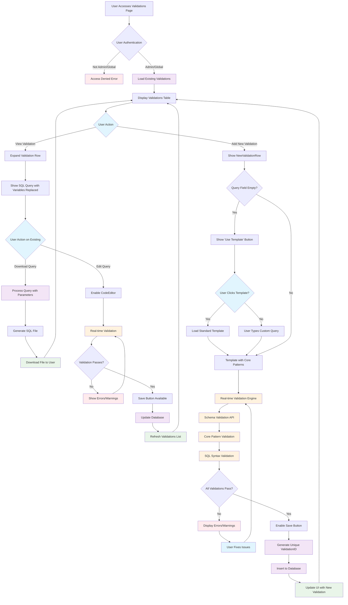
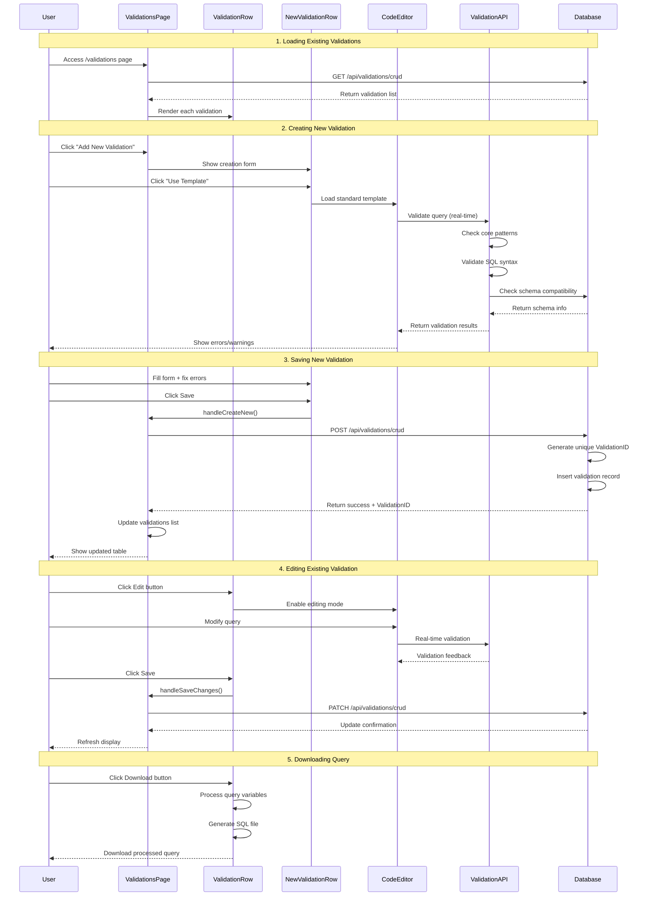
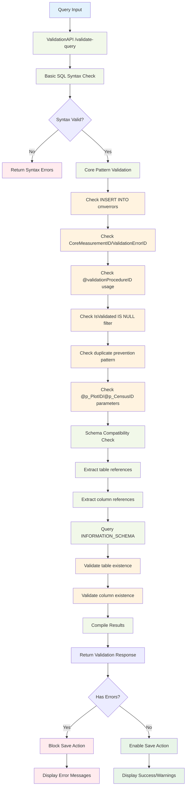

# Validation System Workflow

## Complete User Journey Flowchart



## Detailed Component Interaction Flow



## Validation Engine Detail Flow



## Database Operations Flow

```mermaid
flowchart TD
    A[API Request] --> B{Operation Type}

    B -->|GET| C[Fetch Existing Validations]
    C --> D[SELECT * FROM sitespecificvalidations]
    D --> E[Return Validation List]

    B -->|POST| F[Create New Validation]
    F --> G[Begin Transaction]
    G --> H[Get Next ValidationID]
    H --> I[SELECT MAX(ValidationID) + 1]
    I --> J[Set ValidationID on Object]
    J --> K[INSERT INTO sitespecificvalidations]
    K --> L[Commit Transaction]
    L --> M[Return ValidationID + InsertID]

    B -->|PATCH| N[Update Existing Validation]
    N --> O[Begin Transaction]
    O --> P[UPDATE WHERE ValidationID = ?]
    P --> Q[Commit Transaction]
    Q --> R[Return Success]

    B -->|DELETE| S[Delete Validation]
    S --> T[Begin Transaction]
    T --> U[DELETE WHERE ValidationID = ?]
    U --> V[Commit Transaction]
    V --> W[Return Success]

    %% Error Handling
    G --> X{Transaction Fails?}
    X -->|Yes| Y[Rollback Transaction]
    Y --> Z[Return Error]
    X -->|No| L

    O --> AA{Update Fails?}
    AA -->|Yes| BB[Rollback Transaction]
    BB --> CC[Return Error]
    AA -->|No| Q

    %% Styling
    classDef operation fill:#e8eaf6
    classDef database fill:#e0f2f1
    classDef success fill:#e8f5e8
    classDef error fill:#ffebee

    class A,B operation
    class D,I,K,P,U database
    class E,M,R,W success
    class Y,Z,BB,CC error
```

## File Structure and Component Relationships

```mermaid
graph TB
    subgraph "Frontend Pages"
        VP[ValidationsPage<br/>/app/.../validations/page.tsx]
    end

    subgraph "React Components"
        VR[ValidationRow<br/>/components/validationrow.tsx]
        NVR[NewValidationRow<br/>/components/newvalidationrow.tsx]
        CE[CodeEditor<br/>/components/client/codeeditor.tsx]
    end

    subgraph "API Routes"
        CRUD[CRUD Operations<br/>/api/validations/crud/route.ts]
        VAL[Query Validation<br/>/api/validations/validate-query/route.ts]
        STRUCT[Schema Structure<br/>/api/structure/[schema]/route.ts]
    end

    subgraph "Database"
        SSV[(sitespecificvalidations)]
        CME[(cmverrors)]
        SCHEMA[(INFORMATION_SCHEMA)]
    end

    subgraph "External Dependencies"
        CM[CodeMirror]
        SQL[SQL Formatter]
        MUI[Material-UI]
    end

    %% Relationships
    VP --> VR
    VP --> NVR
    VR --> CE
    NVR --> CE

    VP --> CRUD
    CE --> VAL
    VAL --> STRUCT

    CRUD --> SSV
    VAL --> SCHEMA
    SSV -.-> CME

    CE --> CM
    CE --> SQL
    VP --> MUI
    VR --> MUI
    NVR --> MUI

    %% Styling
    classDef page fill:#e3f2fd
    classDef component fill:#f3e5f5
    classDef api fill:#fff3e0
    classDef database fill:#e0f2f1
    classDef external fill:#fafafa

    class VP page
    class VR,NVR,CE component
    class CRUD,VAL,STRUCT api
    class SSV,CME,SCHEMA database
    class CM,SQL,MUI external
```

## Key Features Summary

### 🔄 **Real-time Validation Flow**

1. User types SQL query
2. 1-second debounce delay
3. API validates syntax + patterns + schema
4. Results displayed immediately
5. Save button enabled/disabled based on validation

### 📋 **Template System**

1. "Use Template" button appears for empty queries
2. Loads corequeries.sql-compliant template
3. Includes all required patterns and parameters
4. Provides clear comments for customization

### 🔍 **Pattern Validation Engine**

- **Required Elements**: INSERT INTO cmverrors, @validationProcedureID, IsValidated IS NULL
- **Recommended Patterns**: DISTINCT, IsActive filters, duplicate prevention
- **Schema Validation**: Table/column existence, proper JOIN patterns

### 💾 **Database Integration**

- Automatic ValidationID generation
- Transaction-safe operations
- Proper error handling and rollback
- Integration with existing corequeries.sql structure

### 📁 **Download Functionality**

- Processes variable replacements (@p_PlotID, @p_CensusID)
- Generates clean SQL files
- Meaningful filename based on procedure name
