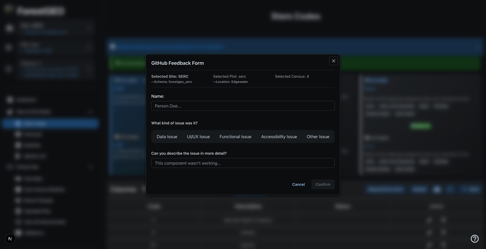
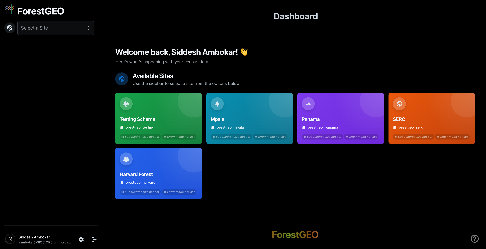
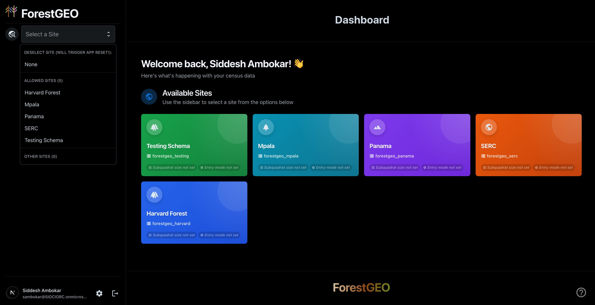
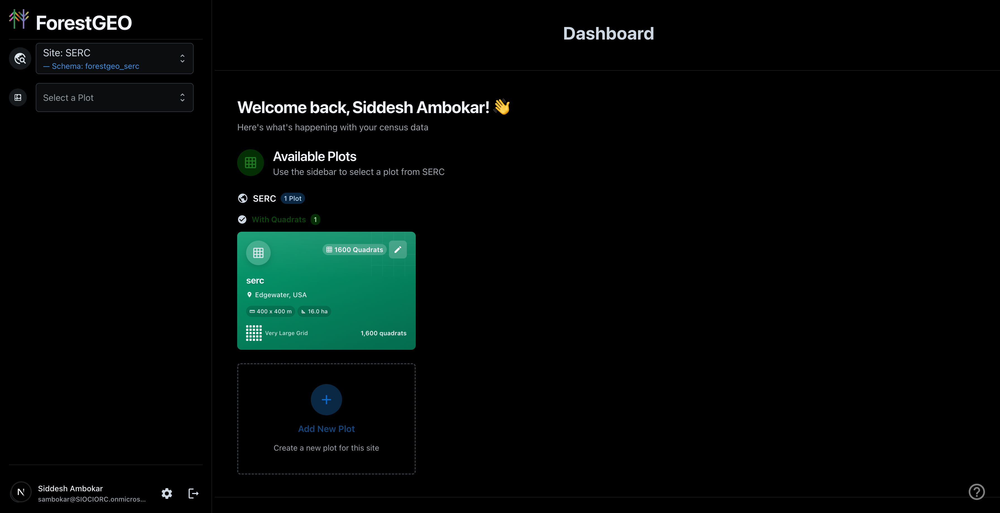
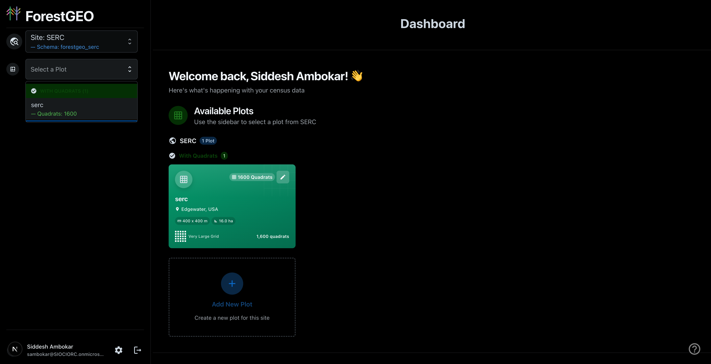
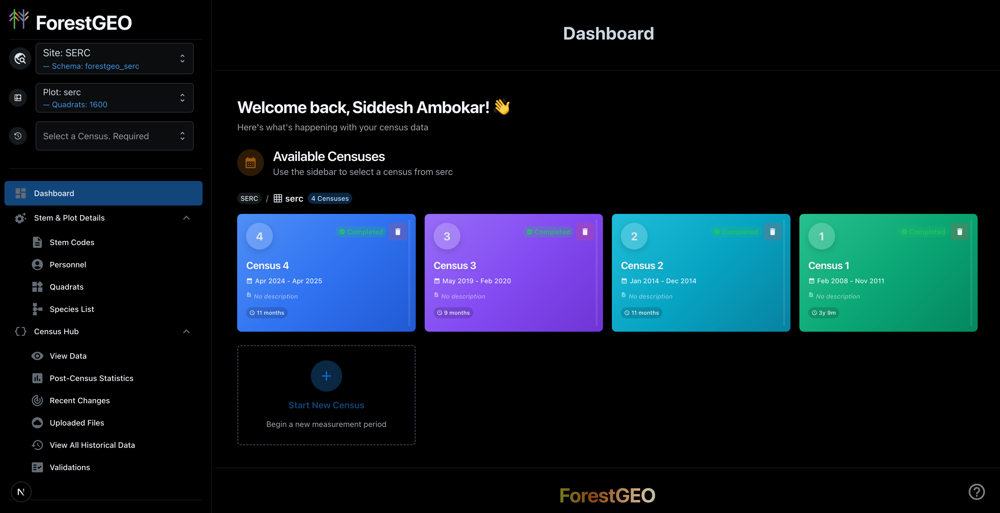
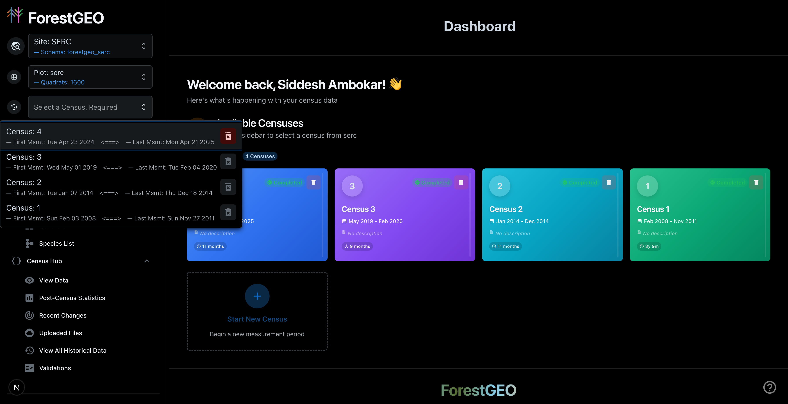
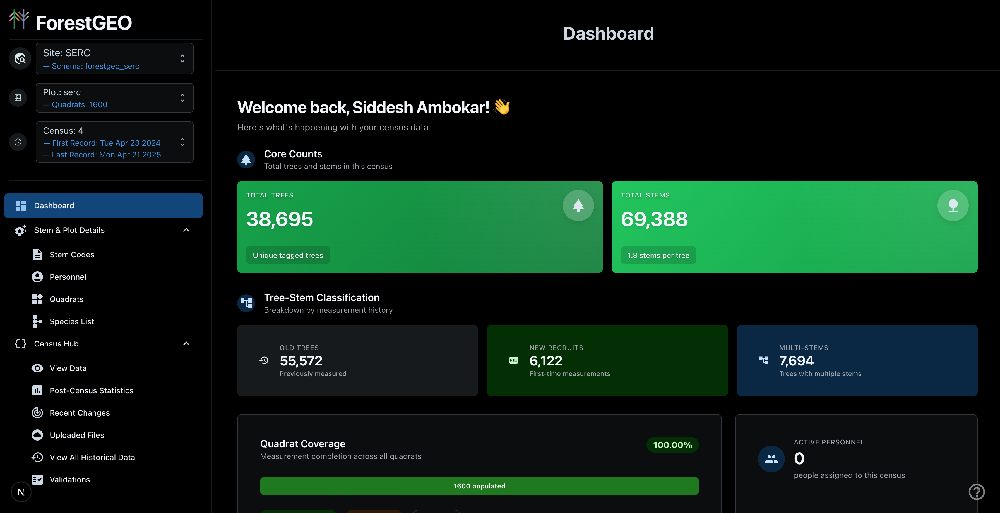

import { Card, CardGrid } from '@astrojs/starlight/components';

Welcome to the ForestGEO Data Processing Application!

## About

The goal of this application is to allow you to record and analyze past and current census data for established global forest sites worldwide. By either directly entering data or uploading CSV/TSV files (conforming to defined constraints), you can save historical data and run validations or analysis on it as you complete a census.

### Summary of Operations

The app is intended to be used as follows:

1. You must be **assigned** to a site by an administrator
2. Select your **site** from the sidebar dropdown
3. Select or create a **plot** within that site
4. Select or create a **census** for data collection
5. Populate your **Fixed Data**:
   - **Quadrats** (required for measurements)
   - **Species List** (required for measurements)
   - Stem Codes (optional - for attribute codes)
   - Personnel (optional - for tracking field staff)
6. Once the required Fixed Data is complete, access **View Data** in the Census Hub
7. Upload or enter **measurements** within the View Data page
8. Validate and edit (if needed) your measurements information
   - If you **upload** measurements, they will automatically be validated!
9. Once you've entered measurements, use **Post-Census Statistics** for analysis
10. If you have permissions, use the **Validations** page to enable, disable, or edit validations

---

## Logging In

Before you can log in, you must complete the following (if you haven't already):

- You must create a **personal** Microsoft (non-SI) account (if you don't have one already)
- An administrator must invite you to the Smithsonian Research Computing tenant
- From here, your account will be added to the ForestGEO app server
- An administrator must assign at least one site to you

Once these steps are finished, you should be able to login to the application and successfully use the site.

:::note
This is a temporary measure! Once the Smithsonian TRB review process completes, ForestGEO users should be able to log in with their SI credentials.
:::

### Logging Into the Website

Navigate to the **production** website instance at [https://forestgeo-livesite.azurewebsites.net](https://forestgeo-livesite.azurewebsites.net).

Click on the login button in the sidebar to authenticate!

#### Submitting Help Tickets

If you encounter issues of any kind, submit a **help ticket** by clicking the **question mark** icon in the bottom right of the screen. This opens a form where you can describe the issue you're encountering.

The feedback form captures your current context (selected site, plot, and census) and allows you to categorize the issue type:

- **Data Issue** - Problems with missing information, incorrect data, or file upload issues
- **UI/UX Issue** - Problems with buttons, pop-ups, navigation, or how the site looks and feels
- **Functional Issue** - Issues with features not working, broken links, or buttons that don't respond
- **Accessibility Issue** - Problems with accessing or using the site, especially for users with disabilities
- **Other Issue** - Any other feedback or issues not listed above

:::note
Completing this form will create a GitHub Issue ticket for developer review!
:::

---

## Using the Sidebar

The sidebar contains **three selection dropdowns** that work progressively - each selection unlocks the next:

### Step 1: Selecting a Site

After you log in, you'll be redirected to the dashboard. The sidebar on the left shows a dropdown to select a **Site**. Initially, you'll see available sites displayed as cards on the dashboard:

Click on the **Site dropdown** to expand it and see all available sites:

Sites are grouped into:

- **Allowed Sites** - Sites assigned to your account (you can edit data here)
- **Other Sites** - Sites you can view but not modify

### Step 2: Selecting a Plot

Once you've selected a site, the dashboard updates to show **Available Plots** as interactive cards, and the **Plot dropdown** becomes available:

Click on the **Plot dropdown** to see all plots for the selected site:

The dropdown shows plots grouped by whether they have quadrats defined. Each plot displays its quadrat count.

:::tip
You can also click on plot cards in the dashboard to select them. Use the **pencil icon** on a plot card to edit its properties.
:::

#### Plot Customization

Use the plot editor to configure:

- Plot name and location
- Dimensions (X and Y)
- Total area
- Quadrat configuration

### Step 3: Selecting a Census

After selecting a plot, the dashboard shows **Available Censuses** as cards and the **Census dropdown** becomes available:

Each census card displays:

- Census number
- Date range (first and last record dates)
- Status information

Click on the **Census dropdown** to expand it:

:::caution
The Census dropdown is marked as **Required** - most application features require a census to be selected before they become accessible!
:::

### Fully Enabled Interface

Once you've selected a site, plot, and census, the navigation menu becomes fully enabled and the dashboard displays detailed metrics:

The dashboard now shows:

- **Core Counts** - Total trees and stems in the census
- **Tree-Stem Classification** - Breakdown of old trees, new recruits, and multi-stem trees
- **Quadrat Coverage** - Measurement completion percentage across all quadrats
- **Active Personnel** - Number of people assigned to the census
- **Data Quality** - Validation status and progress
- **Your Profile** - Your assigned role and site access
- **Recent Activity** - Latest changes to census data

---

## Core Concepts

This app operates along the following **core concepts**:

1. **Site**: A geographic location containing one or more plots (e.g., "Panama", "Harvard Forest")
2. **Plot**: A specific geographic region marked for data collection within a site
3. **Quadrat**: A subdivision of a plot - typically a standardized 20m × 20m area
4. **Census**: A date range denoting a distinct time period where data was collected

---

## Understanding the Navigation

Once you've selected a site, plot, and census, the navigation menu becomes active. It's organized into two main sections:

### Stem & Plot Details (Fixed Data)

This section manages reference data for your census. Some data types are **required** for measurement uploads, while others are optional.

#### Required for Measurements

<CardGrid>
  <Card title="Quadrats" icon="seti:html">
    **Required.** Geographic subdivisions of your plot. Each measurement references a quadrat by name. Define coordinates, dimensions, and area for each
    quadrat.
  </Card>
  <Card title="Species List" icon="star">
    **Required.** Inventory of species found in the plot. Each measurement references a species code. Species codes must exist before uploading measurements.
  </Card>
</CardGrid>

#### Optional Data Types

<CardGrid>
  <Card title="Stem Codes" icon="document">
    **Optional.** Shorthand codes describing tree/stem conditions (e.g., "D" for dead, "L" for leaning). Used in the optional `codes` field of measurements.
  </Card>
  <Card title="Personnel" icon="open-book">
    **Optional.** Field staff and data collection team members. Useful for tracking who collected data, but not validated during measurement uploads.
  </Card>
</CardGrid>

:::note
The **View Data** page in the UI requires all four Fixed Data types to have at least one record. This is a UX safeguard to encourage complete census setup, even though only Quadrats and Species are technically required for measurement uploads.
:::

### Census Hub (Measurements & Analysis)

This section handles measurement data and census analysis:

| Page                         | Description                                                |
| ---------------------------- | ---------------------------------------------------------- |
| **View Data**                | View, edit, and upload measurements for the current census |
| **Post-Census Statistics**   | Run statistical analyses on your census data               |
| **Recent Changes**           | Audit trail showing all data modifications                 |
| **Uploaded Files**           | History of files uploaded with download links              |
| **View All Historical Data** | Browse measurements across all censuses                    |
| **Validations**              | Configure and manage data validation rules                 |

---

## Creating a New Census

To start a new census:

1. Select your site and plot
2. On the dashboard, scroll to the census section
3. Click the **Start New Census** button
4. The new census will be created and appear in the list

:::tip
New censuses are created with the next sequential number (Census 1, Census 2, etc.).
:::

#### Deleting a Census

Each census card has a **trash icon** that allows deletion.

:::caution
You can only delete the **most recent** census! Previous censuses are preserved as historical data.
:::

---

## Next Steps

Once you've made your selections and understand the navigation:

1. **Add Fixed Data** - Start with [Understanding SAPD Datagrids](/ForestGEO/understanding-sapd-datagrids/) to learn how the data entry grids work
2. **Upload Measurements** - See [Upload Process Breakdown](/ForestGEO/upload-process-breakdown/) for the complete upload workflow
3. **Run Validations** - Learn about [Validations & Statistics](/ForestGEO/validations-statistics/) to ensure data quality

<CardGrid stagger>
  <Card title="Datagrids Guide" icon="document">
    Learn how to use the data entry grids for viewing, editing, and uploading data. [Read the guide →](/ForestGEO/understanding-sapd-datagrids/)
  </Card>
  <Card title="Upload Process" icon="rocket">
    Understand the complete file upload workflow from start to finish. [Learn more →](/ForestGEO/upload-process-breakdown/)
  </Card>
  <Card title="Validations" icon="warning">
    Configure validation rules and review data quality checks. [Explore →](/ForestGEO/validations-statistics/)
  </Card>
  <Card title="Glossary" icon="open-book">
    Understand key terminology used throughout the application. [View glossary →](/ForestGEO/framework/glossary-of-terms/)
  </Card>
</CardGrid>
