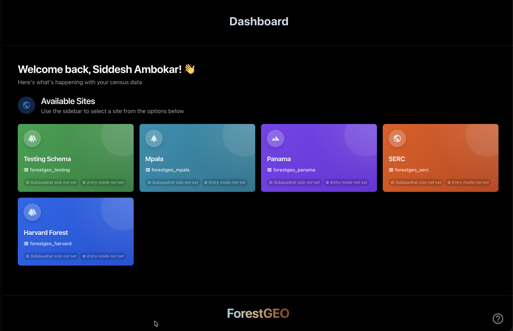
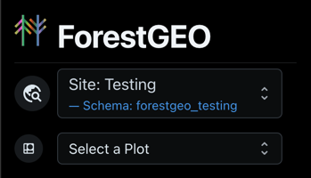
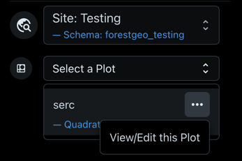
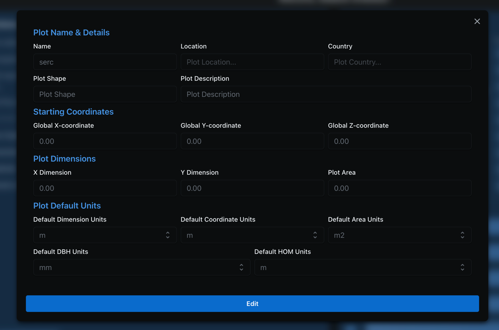
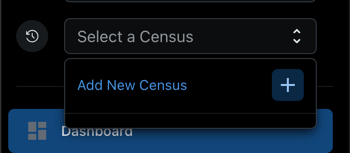
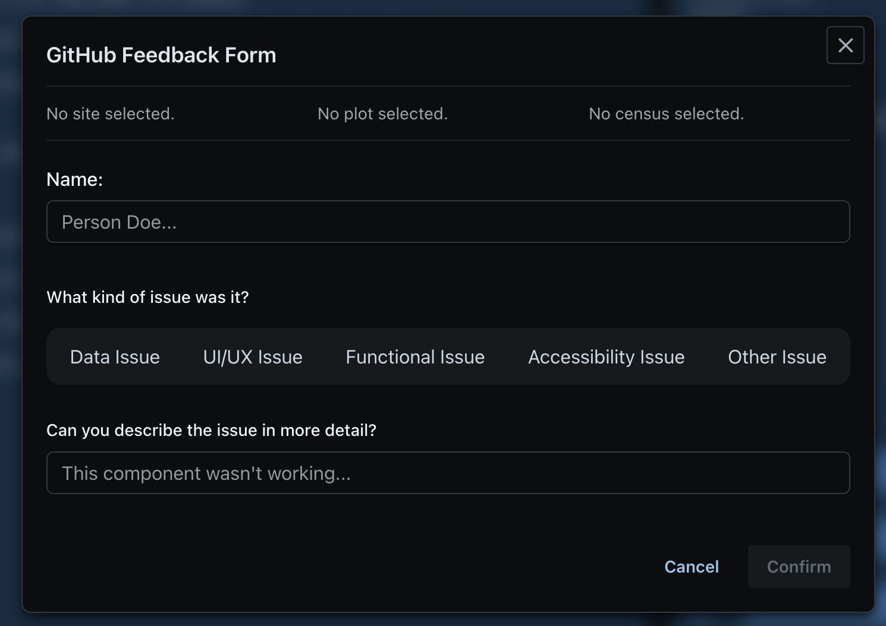

Welcome to the ForestGEO Data Processing Application!

## Introduction

The goal of this application is to allow you to record and analyze past and current census data for established global sites worldwide. 
By either directly entering data or uploading CSV/TSV files (conforming to defined constraints), you can save historical data and run validations or analysis on it as you complete a census.

## Logging In

Before you can log in, you must complete the following (if you haven't already):

- You must create a **personal** Microsoft (non-SI) account (if you don't have one already)
- An administrator must invite you to the Smithsonian Research Computing tenant.
- From here, your account will be added to the ForestGEO app server
- An administrator must assign at least one site to you

Once these steps are finished, you should be able to login to the application and successfully use the site.

:::note
This is a temporary measure! Once the Smithsonian TRB review process completes, ForestGEO users should be able to log in with their SI credentials.
:::

## Selection System - Getting to your Data

The application employs a selection system that enables users to choose from a site, plot, and census. After doing so, they can upload, analyze, or update information as needed.

Each subsection of the selection system appears iteratively -- for example, the site selection appears first, but only after a site is selected does the plot selection appear, and only after 
the plot is selected does the census selection appear. 

### Sites Overview and Selection

After you log in, you will be directed to the primary view of the application -- a sidebar and a dashboard view. 
Depending on the sites you have been assigned, you should see some variation of the following on the dashboard view. This has been termed the Sites Overview:

#### The Sites Overview

The Sites Overview denotes the grid/card view of sites that you have access to. You should be able to see the following core components: 

### Selecting a Plot

Once you've selected a site, you'll be able to select a **Plot**, looking something like this:

:::note
Please note - the plot you'll first see is a **placeholder**! Please use the **ellipsis** button to open the customization popup:
:::

#### Customizing Your Plot

Use this to customize your plot! After saving, your selections will reset and the site will update itself. Please ensure your edits are visible when you attempt to select the plot again!

### Creating or Selecting

This app operates along the following **core concepts**:

1. **Site**: A site is a collection of plots.
2. **Plot**: A plot is a geographic region marked for data collection
3. **Quadrat**: A subdivision of a plot -- this tends to be a standardized 20 x 20 box
4. **Census**: A census is a **date range** denoting a distinct time period where data was collected in the **Plot**

With this in mind, you will need to create a census before you can begin entering data. After opening the Census dropdown, click on the **Add New Census** button to automatically add a new census:

Creating a new census will also trigger a selection reset. Please re-select your prior selections, and you should be able to see your new census displayed.

#### Understand the Data Types

There are **three** core data types that are required before you can record measurements for a census.

import { Card, CardGrid } from '@astrojs/starlight/components';

## Quick Start

<CardGrid stagger>
  <Card title="Stem Codes" icon="star">
    A list of shorthand codes designating attributes that can assigned to a tree/stem object.
  </Card>
  <Card title="" icon="document">
    Understand the complete file upload workflow from start to finish. [Learn more →](/ForestGEO/upload-process-breakdown/)
  </Card>
  <Card title="Error Guide" icon="warning">
    Find solutions to common errors you may encounter. [Troubleshoot →](/ForestGEO/errors/error-guide-overview/)
  </Card>
  <Card title="Personnel" icon="open-book">
    A list of personnel working on the census. Additionally, you can add/designate roles to each user to better denote how personnel are distributed job-wise
    across the census.
  </Card>
</CardGrid>

They are:

- **Stem Codes**: A list of shorthand codes designating attributes that can assigned to a tree/stem object.
- ~~**Personnel**: A list of personnel working on the census. Additionally, you can add/designate roles to each user to better denote how personnel are distributed job-wise across the census.~~
- **Quadrats**: A breakdown of the plot into smaller, standardized area segments.
- **Species**: A list of species found in the plot. Each species is assigned a shorthand **Species Code** to allow rapid assignment when actively recording statistics in the field.

#### Deleting a Census?

If your permissions allow it, you may be able to highlight and click on a **Trashcan** icon along the **latest** census. Clicking on this will delete the census in question.

:::caution
You won't be able to delete a census if it's NOT the latest census!
:::

### Logging Into the Website

In order to log into the website proper, please navigate to the **production** website instance, available at [https://forestgeo-livesite.azurewebsites.net](https://forestgeo-livesite.azurewebsites.net).

Click on the login icon to log in!

#### Submitting Help Tickets

In the event that you run into issues of any kind, please submit a **help ticket** by clicking on the **question mark** icon in the bottom right of the screen. This button will open a form allowing you to explain the issue you're encountering!

:::note
Completing this will create a GitHub Issue ticket for further review!
:::