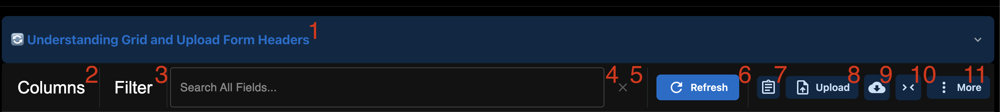
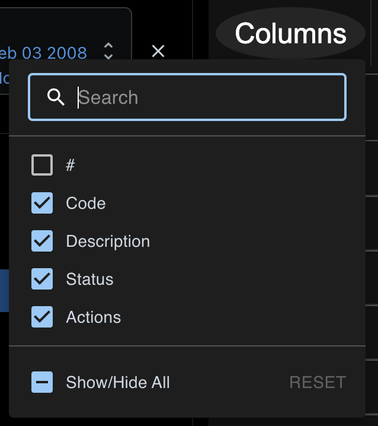
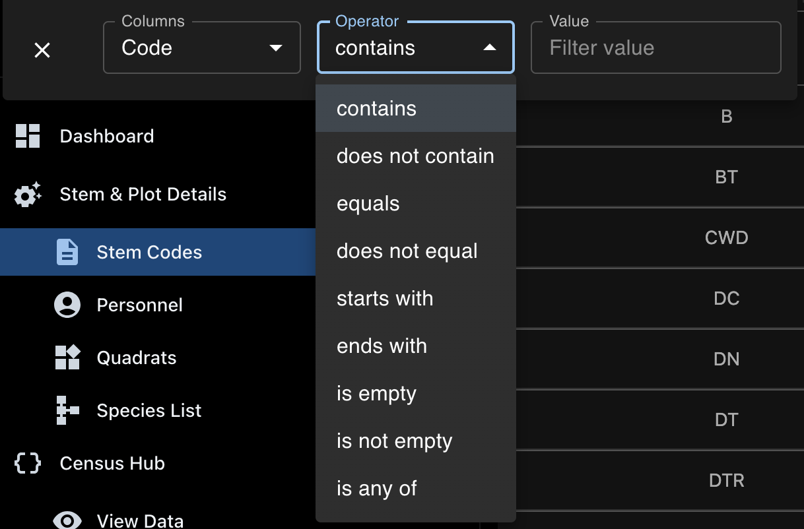

## Understand the Data Types

There are four core data types accepted as Stem & Plot Details values.

import { Card, CardGrid } from '@astrojs/starlight/components';

<CardGrid stagger>
  <Card title="Stem Codes" icon="star">
    A list of shorthand codes designating attributes that can assigned to a tree/stem object.

    [Learn More](understanding-stem-codes.mdx)
  </Card>
  <Card title="Quadrats" icon="document">
    A breakdown of the plot into smaller, standardized area segments.

    [Learn More](understanding-quadrats.mdx)
  </Card>
  <Card title="Species" icon="warning">
    A list of species found in the plot. 
    
    Each species is assigned a shorthand **Species Code** to allow rapid assignment when actively recording statistics in the field.

    [Learn More](understanding-species.mdx)
  </Card>
  <Card title="Personnel" icon="open-book">
    A list of personnel working on the census. 
    
    Additionally, you can add/designate roles to each user to better denote
    how personnel are distributed job-wise across the census. 

:::note 
Personnel are **not required** to submit measurements! 
:::

    [Learn More](understanding-personnel.mdx)
  </Card>
</CardGrid>

## Common Elements

### Header/Form Dropdown 

#1 in the image indicates the Header/Form Dropdown! 
This is an expandable view that can be used to review the existing headers defined for the data type along with their corresponding form header (when uploading CSV files).

:::note
All table views have this dropdown, but the details **in** each dropdown will be unique to the table view!
:::

### Editing Toolbar

The remaining numbered elements in the image correspond to elements in the EditToolbar! Each table view has an EditToolbar -- however, you will see variance in 
the specific elements available. 

The presented organization of the EditToolbar is standardized for **all** supporting data views. 

#### Column Selection

Each table/supporting data view will allow you to interact with the columns visible in the view in two ways:

##### #2 - Columns Toggle

Clicking on the **Columns** will open a dropdown of selectable columns that you can use to enhance or simplify the data view. 
For example, in the Stem Codes view, the dropdown should look like this: 

:::note
Please note the Show/Hide All and RESET buttons, along with the Search box. 
:::

##### #10 - Empty Columns Toggle

In addition to the columns dropdown, the system **automatically** hides all columns that have **no values**! 

Clicking on the toggle will forcibly show all columns, regardless of content.

#### Filtering Options

##### #3 - Manual Filtration Interface 

Clicking on the Filter button will open the manual filtration interface. This will allow you to create customized filter statements targeted to specific columns and values.

Please note: Filters will only become active when you populate **all three fields** - column, condition, value!

The type of filter options available to you will change depending on the type of column you're filtering!

###### String Column Filtration Options

###### 