The datagrids are a key component of the app's user interface. They manage everything from data review to editing to insertion. This guide explains how to use the datagrids effectively.

---

## Overview

Datagrids are used throughout the application for:

- **Viewing data** - Browse records with sorting and filtering
- **Editing data** - Make inline changes to existing records
- **Adding data** - Insert new records via forms or file upload
- **Exporting data** - Download data as CSV files

---

## Stem Codes (Example)

The Stem Codes datagrid can be considered a "default" representation of the datagrid system. It should look something like this after you've added data to it:

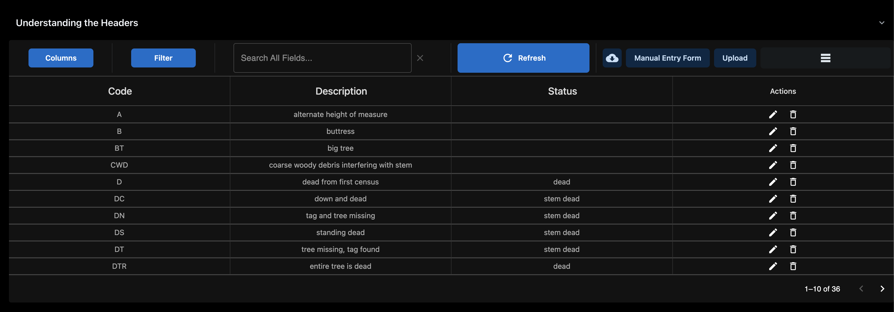

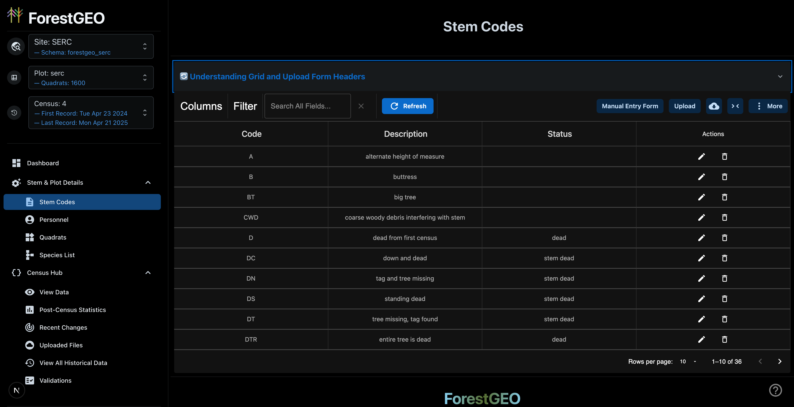

---

## Understanding the Headers

Similar to what's present in the upload cycle, there is an accordion dropdown presenting an explanation of the columns displayed in the datagrid:

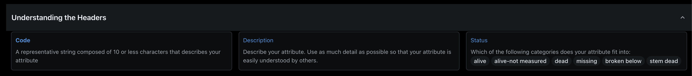

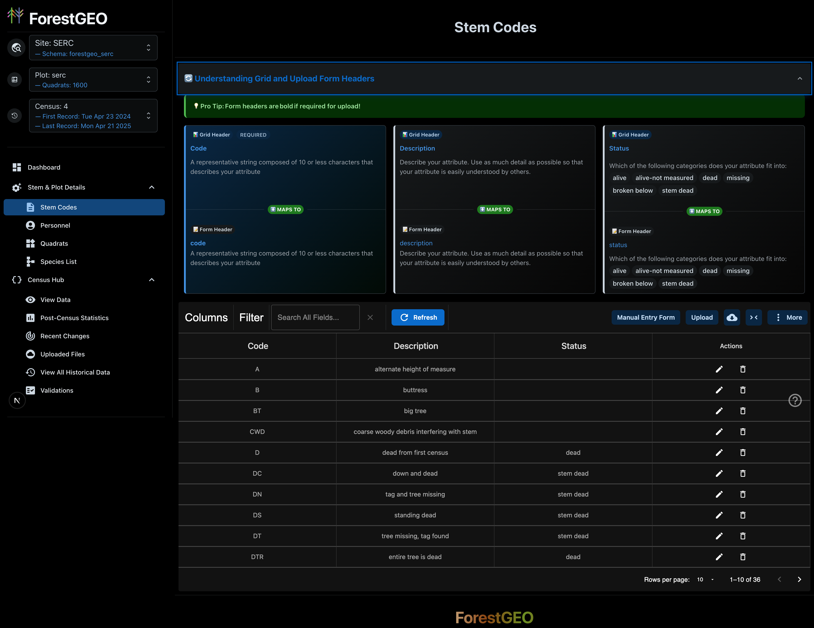

:::note
These headers are **not the same** as those present in the upload cycle/form requirements!

The datagrid may show additional metadata columns that aren't part of the upload format.
:::

---

## The Edit Toolbar

The Edit Toolbar appears at the top of every datagrid and provides controls for working with your data:

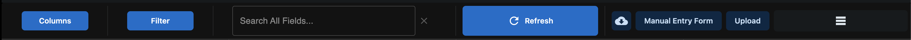

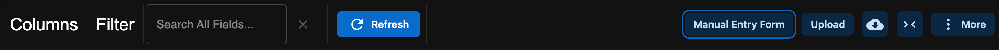

:::caution
All the components described here are present across **all** datagrid implementations in the application.
:::

### Toolbar Components Overview

| Component         | Location  | Purpose                        |
| ----------------- | --------- | ------------------------------ |
| Columns Button    | Left      | Show/hide columns              |
| Filter Button     | Left      | Add data filters               |
| Search Box        | Center    | Quick search across all fields |
| Refresh Button    | Center    | Reload grid data               |
| Manual Entry      | Right     | Open bulk entry form           |
| Upload Button     | Right     | Upload data from file          |
| Ancillary Actions | Far Right | Grid-specific actions          |

---

### Columns & Filtering

The columns and filtering buttons on the left side of the Edit Toolbar allow you to customize the data view.

#### Column Dropdown

The column dropdown allows you to choose which columns are displayed:

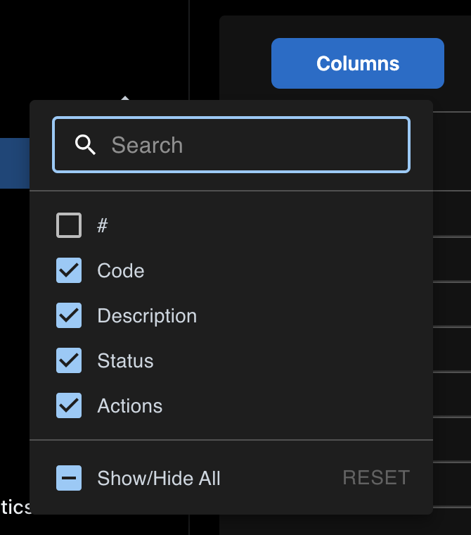

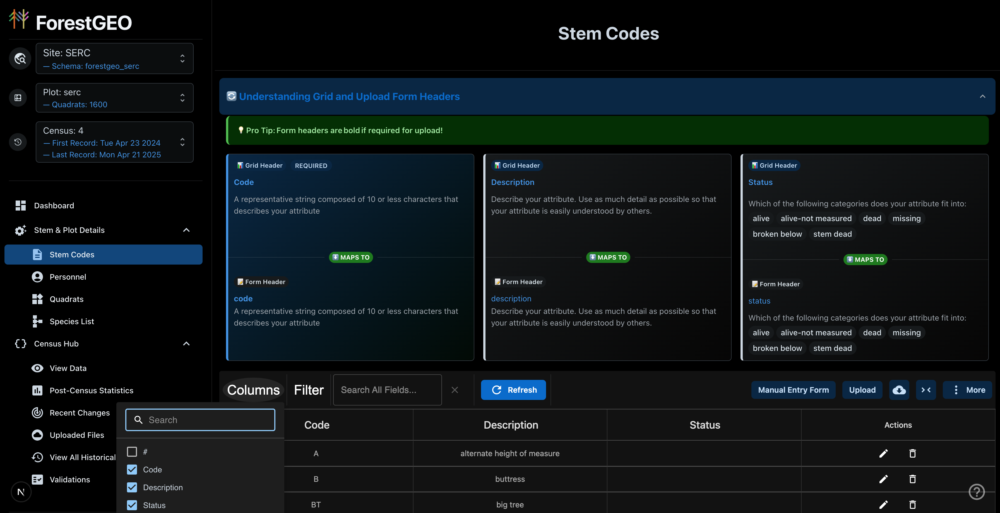

- **Check** a column name to show it
- **Uncheck** a column name to hide it
- Changes apply immediately

:::caution
The columns selectable include **metadata columns** (like IDs and timestamps). These are not typically used in day-to-day operations but can be useful for troubleshooting.
:::

#### Filter Dropdown

The filter dropdown provides a customizable filtering system to narrow the data displayed:

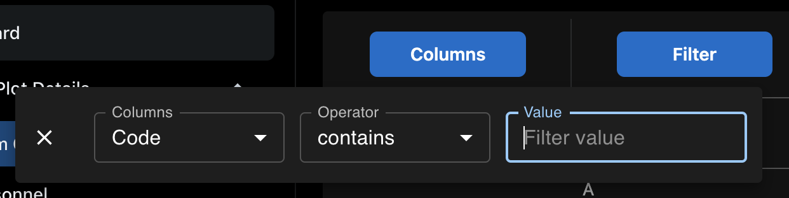

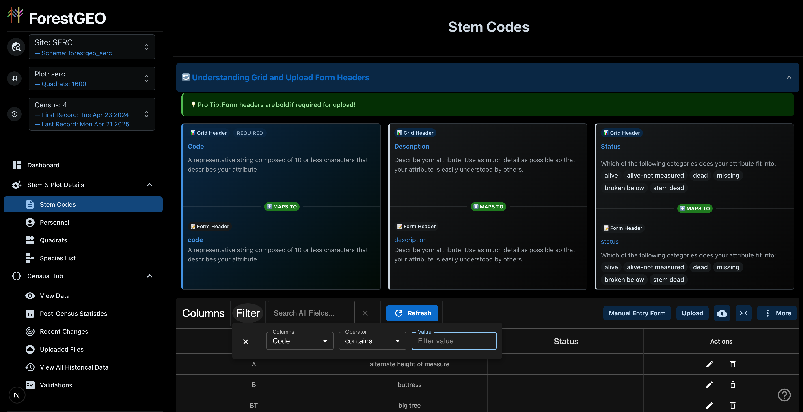

Each filter row requires **three selections**:

1. **Column** - Which field to filter on
2. **Operator** - How to compare (equals, contains, greater than, etc.)
3. **Value** - The value to filter by

:::note
Each filter will only trigger after all **three** categories of the filter row are filled!
:::

**Available Operators:**

| Operator     | Description   | Example                      |
| ------------ | ------------- | ---------------------------- |
| equals       | Exact match   | Status equals "alive"        |
| contains     | Partial match | Code contains "D"            |
| starts with  | Begins with   | QuadratName starts with "03" |
| ends with    | Ends with     | Code ends with "1"           |
| is empty     | No value      | Description is empty         |
| is not empty | Has value     | Status is not empty          |
| `>`          | Greater than  | DBH `>` 100                  |
| `<`          | Less than     | DBH `<` 50                   |

---

### Search All Fields & Refresh Button

#### Quick Search

The `Search All Fields` textbox is a **quick filter** alternative to the Filter dropdown:

- Enter text to search across **all columns and all rows**
- Results update as you type
- Use for quick lookups when you don't need precise filtering

#### Refresh Button

The `Refresh` button triggers a **local** reload of the grid view:

- Fetches fresh data from the server
- Useful after other users make changes
- Clears any unsaved local state

:::caution
**Local vs Global Refresh**: In the View Data grid (measurements), there's a distinction between local refresh (grid only) and global refresh (entire application state). This difference is not relevant for Fixed Data grids.
:::

---

### Data Import/Export

The right side of the Edit Toolbar contains data entry and export options.

#### File Upload

Click the **Upload** button to open the file upload interface. This allows you to:

- Upload CSV or TSV files
- Preview data before committing
- Review any parsing errors

See [Upload Process Breakdown](/ForestGEO/upload-process-breakdown/) for detailed information.

#### The Manual Entry Form

The Manual Entry Form allows for bulk form input of data. Click the **Manual Entry** button to open it:

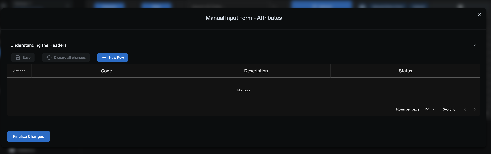

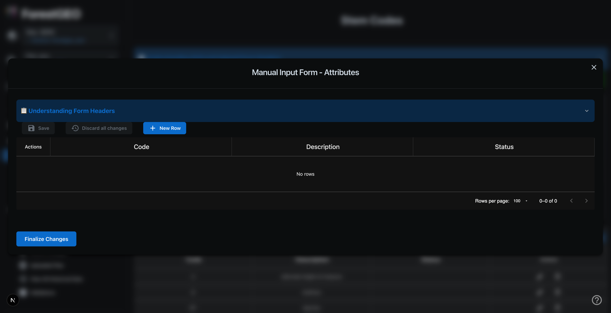

**How to use the Manual Entry Form:**

1. Click **Add Row** to create a new empty row
2. Fill in the field values
3. Click **Save** to save your changes locally
4. Repeat for additional rows
5. Click **Finalize Changes** to submit all rows to the database

:::note
The `Understanding the Headers` accordion is available here too - use it to understand what each field requires.
:::

**Actions Tab:**

The Actions column in the Manual Entry Form provides row-level operations:

- **Delete Row** - Remove a row before submission
- **Duplicate Row** - Copy an existing row

#### CSV Export

Click the **Export** button (if available) to download the current grid data as a CSV file. The export includes:

- All visible columns
- All rows matching current filters
- Properly formatted for re-import

---

### Ancillary Actions

To the right of the Upload button are additional action buttons. These vary by grid type.

#### Toggle Empty Columns

The **Hamburger icon** (☰) toggles visibility of empty columns:

- **Hidden by default**: Columns with no data in any row are automatically collapsed
- **Click to show**: Reveals all columns including empty ones

:::tip
This helps focus on relevant data when many optional columns exist.
:::

#### Unique Ancillary Actions by Grid

| Grid             | Additional Actions                                     |
| ---------------- | ------------------------------------------------------ |
| **Stem Codes**   | None                                                   |
| **Personnel**    | None                                                   |
| **Quadrats**     | None                                                   |
| **Species List** | **RESET Table** - Clears all species data (admin only) |

:::caution
The RESET Table action is destructive and cannot be undone! Use with extreme caution.
:::

---

## Editing Data

### Inline Editing

Most datagrids support inline editing:

1. **Click** on a cell to select it
2. **Double-click** or press **Enter** to enter edit mode
3. **Modify** the value
4. Press **Enter** to save or **Escape** to cancel

### Row Actions

Each row may have an Actions column with:

- **Edit** (pencil icon) - Enter edit mode for the entire row
- **Delete** (trash icon) - Remove the row
- **View Details** - See full record information

:::note
Changes are saved immediately to the database. There is no separate "Save" step for inline edits.
:::

---

## Grid-Specific Information

### Stem Codes Grid

**Purpose**: Define attribute codes describing tree/stem conditions

**Key Columns:**
| Column | Description | Required |
|--------|-------------|----------|
| Code | Short code (up to 10 characters) | Yes |
| Description | Explanation of the code | No |
| Status | Category: alive, dead, missing, etc. | No |

### Personnel Grid

**Purpose**: Record field staff working on the census

**Key Columns:**
| Column | Description | Required |
|--------|-------------|----------|
| FirstName | Staff member's first name | Yes |
| LastName | Staff member's last name | Yes |
| Role | Job function during census | Yes |
| RoleDescription | Detailed role explanation | No |

### Quadrats Grid

**Purpose**: Define plot subdivisions

**Key Columns:**
| Column | Description | Required |
|--------|-------------|----------|
| QuadratName | Unique identifier (e.g., "0322") | Yes |
| StartX | X coordinate of quadrat origin | Yes |
| StartY | Y coordinate of quadrat origin | Yes |
| DimX | Width along X axis | Yes |
| DimY | Width along Y axis | Yes |
| Area | Calculated area | Yes |
| QuadratShape | Description of shape | No |

### Species List Grid

**Purpose**: Maintain inventory of species in the plot

**Key Columns:**
| Column | Description | Required |
|--------|-------------|----------|
| SpeciesCode | Shorthand identifier (e.g., "AESPO") | Yes |
| Family | Taxonomic family | No |
| Genus | Taxonomic genus | No |
| SpeciesName | Species name | Yes |
| Authority | Taxonomic authority | No |

---

## Best Practices

1. **Use filters strategically** - Apply filters before making bulk changes
2. **Verify before uploading** - Preview your data in the upload interface
3. **Check the headers** - Use the Understanding Headers accordion to avoid format errors
4. **Export for backup** - Download your data before making significant changes
5. **Refresh regularly** - Keep your view current, especially in multi-user environments
