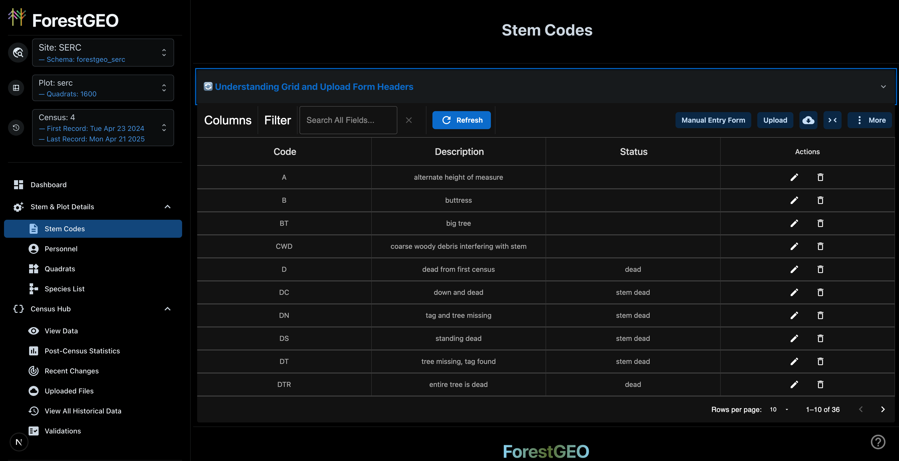
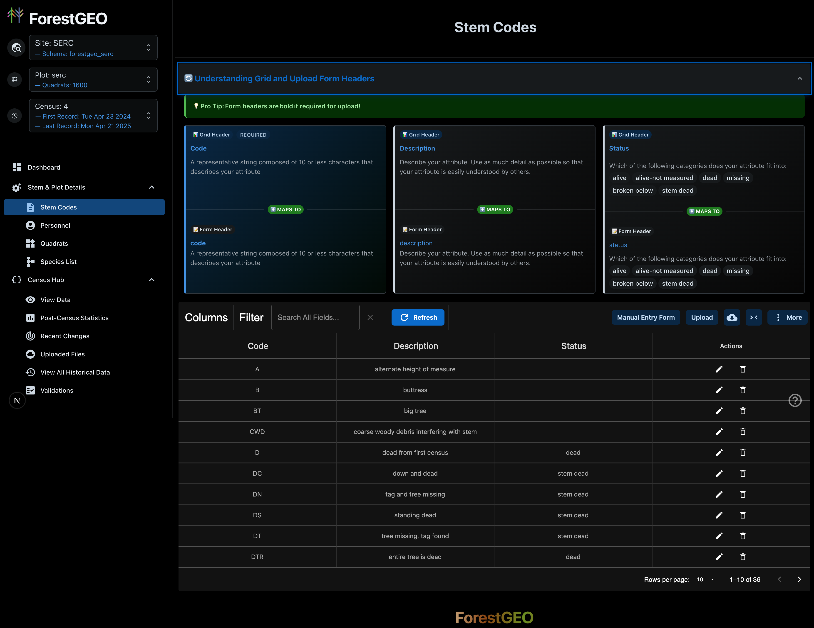
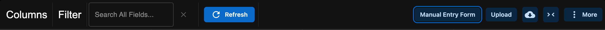
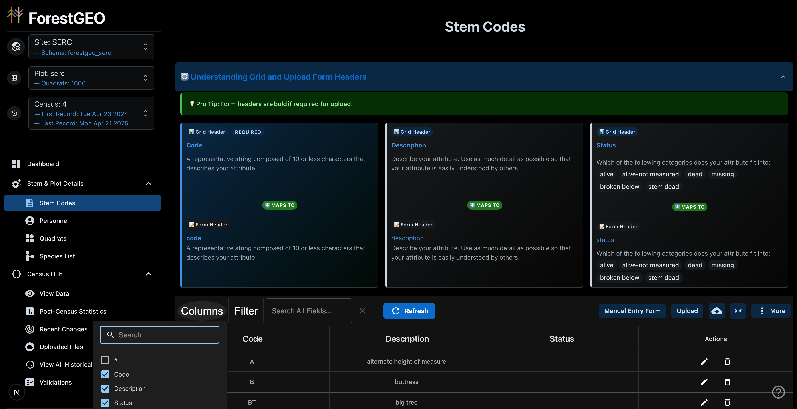
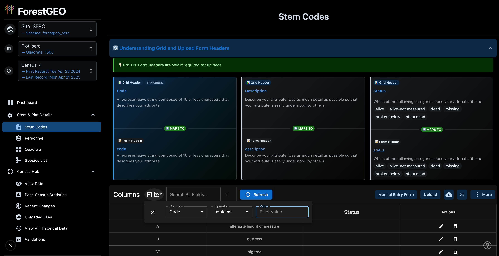
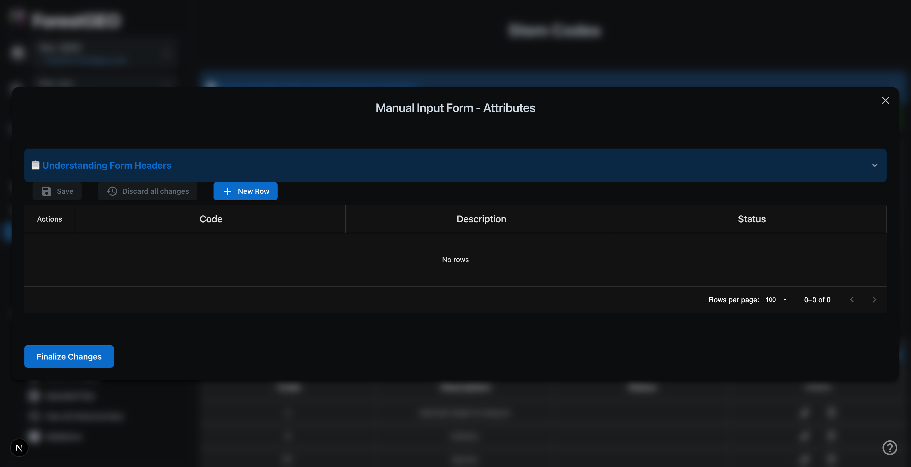

The datagrids are a key component of the app's user interface. They manage everything from data review to editing to insertion. This guide explains how to use the datagrids effectively.

---

## Overview

Datagrids are used throughout the application for:

- **Viewing data** - Browse records with sorting and filtering
- **Editing data** - Make inline changes to existing records
- **Adding data** - Insert new records via forms or file upload
- **Exporting data** - Download data as CSV files

---

## Stem Codes (Example)

The Stem Codes datagrid can be considered a "default" representation of the datagrid system. It should look something like this after you've added data to it:

---

## Understanding the Headers

Similar to what's present in the upload cycle, there is an accordion dropdown presenting an explanation of the columns displayed in the datagrid:

:::note
These headers are **not the same** as those present in the upload cycle/form requirements!

The datagrid may show additional metadata columns that aren't part of the upload format.
:::

---

## The Edit Toolbar

The Edit Toolbar appears at the top of every datagrid and provides controls for working with your data:

:::caution
All the components described here are present across **all** datagrid implementations in the application.
:::

### Toolbar Components Overview

| Component         | Location  | Purpose                        |
| ----------------- | --------- | ------------------------------ |
| Columns Button    | Left      | Show/hide columns              |
| Filter Button     | Left      | Add data filters               |
| Search Box        | Center    | Quick search across all fields |
| Refresh Button    | Center    | Reload grid data               |
| Add record        | Right     | Open the bulk entry form       |
| Upload Button     | Right     | Upload data from file          |
| Ancillary Actions | Far Right | Grid-specific actions          |

---

### Columns & Filtering

The columns and filtering buttons on the left side of the Edit Toolbar allow you to customize the data view.

#### Column Dropdown

The column dropdown allows you to choose which columns are displayed:

- **Check** a column name to show it
- **Uncheck** a column name to hide it
- Changes apply immediately

:::caution
The columns selectable include **metadata columns** (like IDs and timestamps). These are not typically used in day-to-day operations but can be useful for troubleshooting.
:::

#### Filter Dropdown

The filter dropdown provides a customizable filtering system to narrow the data displayed:

Each filter row requires **three selections**:

1. **Column** - Which field to filter on
2. **Operator** - How to compare (equals, contains, greater than, etc.)
3. **Value** - The value to filter by

:::note
Each filter will only trigger after all **three** categories of the filter row are filled!
:::

**Available Operators:**

| Operator     | Description   | Example                      |
| ------------ | ------------- | ---------------------------- |
| equals       | Exact match   | Status equals "alive"        |
| contains     | Partial match | Code contains "D"            |
| starts with  | Begins with   | QuadratName starts with "03" |
| ends with    | Ends with     | Code ends with "1"           |
| is empty     | No value      | Description is empty         |
| is not empty | Has value     | Status is not empty          |
| `>`          | Greater than  | DBH `>` 100                  |
| `<`          | Less than     | DBH `<` 50                   |

---

### Search All Fields & Refresh Button

#### Quick Search

The `Search All Fields` textbox is a **quick filter** alternative to the Filter dropdown:

- Enter text to search across **all columns and all rows**
- **Press Enter to apply the filter** — results do not update as you type
- Clear the box and press Enter again to restore the full view
- Use for quick lookups when you don't need precise filtering

#### Refresh Button

The `Refresh` button triggers a **local** reload of the grid view:

- Fetches fresh data from the server
- Useful after other users make changes
- Clears any unsaved local state

:::caution
**Local vs Global Refresh**: In the View Data grid (measurements), there's a distinction between local refresh (grid only) and global refresh (entire application state). This difference is not relevant for the supporting-data grids.
:::

---

### Data Import/Export

The right side of the Edit Toolbar contains data entry and export options.

#### File Upload

Click the **Upload** button to open the file upload interface. This allows you to:

- Upload CSV or TSV files
- Preview data before committing
- Review any parsing errors

See [Upload Process Breakdown](/ForestGEO/upload-process-breakdown/) for detailed information.

#### The Manual Entry Form

The manual entry form allows for bulk form input of data. Click **Add record** to open it (on the measurements grid the same button reads **Manual entry**):

**How to use the Manual Entry Form:**

1. Click **New Row** to create a new empty row
2. Fill in the field values
3. Click **Save** to save your changes locally
4. Repeat for additional rows
5. Click **Finalize Changes** to submit all rows to the database

:::note
The `Understanding the Headers` accordion is available here too - use it to understand what each field requires.
:::

**Actions Tab:**

The Actions column in the Manual Entry Form provides row-level operations:

- **Discard changes** - Roll a row back to its last saved state
- **Delete** - Remove a row before submission

#### CSV Export

Click the cloud-download icon in the toolbar (tooltip: **Export as CSV**) to download the grid data. Worth knowing before you rely on it:

- The file contains the **upload-form columns** for that data type, not whatever columns you currently have visible — so hiding columns does not shrink the export
- It is formatted for re-import, which is what makes export-edit-reupload a practical way to fix many rows at once
- Whether your active filters carry through depends on the grid; the Species List and Stem Codes grids pass them, the Quadrats grid exports everything
- The historical-data view has no export button

---

### Ancillary Actions

To the right of the Upload button are additional action buttons. These vary by grid type.

#### Toggle Empty Columns

The **expand/collapse icon** (a stacked pair of chevrons) toggles visibility of columns that hold no data in any row.

- On the supporting-data grids, empty columns start out **visible** — click to hide them
- On the Species List and the measurements grid, they start out **hidden** — click to reveal them

:::tip
This helps focus on relevant data when many optional columns exist.
:::

#### Unique Ancillary Actions by Grid

| Grid             | Additional Actions                                     |
| ---------------- | ------------------------------------------------------ |
| **Stem Codes**   | None                                                                        |
| **Quadrats**     | None                                                                        |
| **Personnel**    | **Edit Roles** - opens the roles list, where role names and descriptions live |
| **Species List** | **Limits** on each row - opens that species's DBH bounds used by validation |

---

## Editing Data

### Inline Editing

Most datagrids support inline editing:

1. **Click** on a cell to select it
2. **Double-click** or press **Enter** to enter edit mode
3. **Modify** the value
4. Press **Enter** to save or **Escape** to cancel

### Row Actions

Each row may have an Actions column with:

- **Edit** (pencil icon) — Enter edit mode for the entire row
- **Delete** (trash icon) — Remove the row
- **View Details** — See full record information
- **Revert** *(measurement rows)* — Roll back the most recent edit on this row

### The Unified Edit Pipeline (April–May 2026)

Edits to measurement rows — whether you start in View Data or View Errors — all flow through one shared pipeline. The pieces you'll see:

- **Impact Summary dialog.** For edits that raise a warning or are destructive, a dialog shows exactly which fields will change, how many other rows are affected (some edits cascade), and any validation warnings the change would raise. The preview is **tamper-proof** — what you see is what gets applied.
- **Typed confirmation for destructive edits.** A destructive single-row edit asks you to type `APPLY`. The bulk revision screen asks for `APPLY` followed by the row count instead, e.g. `APPLY 42`. Routine edits apply straight away with no dialog.
- **Undo toast.** Immediately after Apply, an Undo toast appears for about 12 seconds. That is the only one-click way back — once it disappears, correct the row with another edit.
- **Auto-refresh.** The grid re-fetches affected rows after Apply — no page reload needed.
- **Clearing a field actually persists.** Earlier versions silently dropped empty edits in some columns; that bug is fixed.

:::note
Most supporting-data grids (Stem Codes, Personnel, Quadrats, Species List) still use the simpler immediate-save flow — there's no Impact Summary because each row stands alone. The unified pipeline applies to **measurement** edits, where one change can ripple through validations and other rows.
:::

---

## Grid-Specific Information

### Stem Codes Grid

**Purpose**: Define attribute codes describing tree/stem conditions

**Key Columns:**
| Column | Description | Required |
|--------|-------------|----------|
| Code | Short code (up to 10 characters) | Yes |
| Description | Explanation of the code | No |
| Status | Category: alive, dead, missing, etc. | No |

### Personnel Grid

**Purpose**: Record field staff working on the census

**Key Columns:**
| Column | Description | Required |
|--------|-------------|----------|
| FirstName | Staff member's first name | Yes |
| LastName | Staff member's last name | Yes |
| Role | Job function during census, chosen from a dropdown of defined roles | Yes |

Role *descriptions* are not a column here — they live in the roles list, which you reach through the **Edit Roles** button on this grid.

### Quadrats Grid

**Purpose**: Define plot subdivisions

**Key Columns:**
| Column | Description | Required |
|--------|-------------|----------|
| QuadratName | Unique identifier (e.g., "0322") | Yes |
| StartX | X coordinate of quadrat origin | Yes |
| StartY | Y coordinate of quadrat origin | Yes |
| DimX | Width along X axis | Yes |
| DimY | Width along Y axis | Yes |
| Area | Calculated area | Yes |
| QuadratShape | Description of shape | No |

### Species List Grid

**Purpose**: Maintain inventory of species in the plot

**Key Columns:**
| Column | Description | Required |
|--------|-------------|----------|
| SpeciesCode | Shorthand identifier (e.g., "AESPO") | Yes |
| Family | Taxonomic family | No |
| Genus | Taxonomic genus | No |
| SpeciesName | Species name | Yes |
| Authority | Taxonomic authority | No |

---

## Best Practices

1. **Use filters strategically** - Apply filters before making bulk changes
2. **Verify before uploading** - Preview your data in the upload interface
3. **Check the headers** - Use the Understanding Headers accordion to avoid format errors
4. **Export for backup** - Download your data before making significant changes
5. **Refresh regularly** - Keep your view current, especially in multi-user environments
