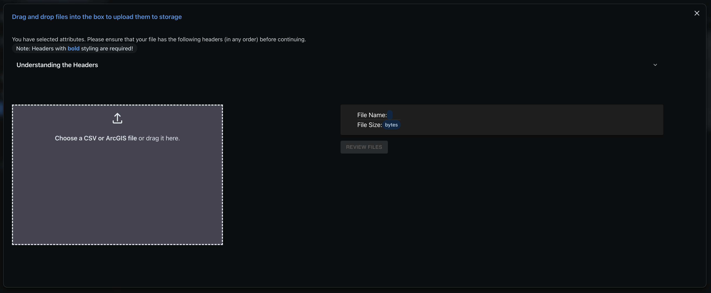
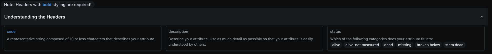
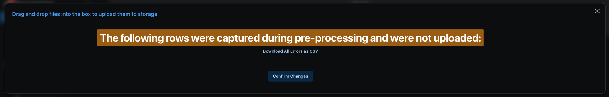

The file upload system is a multi-stage process that handles data parsing, validation, database insertion, and cloud backup. This guide explains each stage in detail.

---

## Overview

The upload cycle follows this general flow:

```
[Select File] → [Parse & Preview] → [Upload to Database] → [Validate] → [Azure Backup] → [Complete]
                                          ↓
                             [Failed Rows] → [Review & Fix] → [Reingest]
```

The core cycle is the same for all data types, but **measurements** have additional processing steps due to their complexity.

---

## Important Notes Before Uploading

:::caution
**Read before uploading!**
:::

1. **Update-forward behavior**: The system ALWAYS tries to update existing data rather than ignoring duplicates. If you upload a file with existing records, those records will be updated.

2. **Don't navigate away**: The upload cycle triggers system updates. **Do not** navigate away, reload the page, or close the browser while an upload is in progress!

3. **Large files**: Files with 50,000+ rows may take several minutes. Monitor the progress bar and estimated time.

4. **File format**: Only CSV, TSV, and TXT files are accepted. UTF-8 encoding is recommended.

---

## Stage 1: Reviewing Headers & File Dropzone

When you click the Upload button, you'll see the file upload interface:



### Understanding the Headers Accordion

Click on **Understanding the Headers** to see the column requirements for the form type:



This accordion shows:

- **Required headers** (marked with asterisk or bold)
- **Optional headers**
- **Data type requirements** for each column
- **Example values**

:::tip
Review this before uploading to ensure your file headers match the expected format.
:::

### Uploading Your File

You have two options:

1. **Drag and drop** your file into the dropzone
2. **Click** the dropzone to open a file browser

The system automatically detects:

- **File format** (CSV, TSV, TXT)
- **Delimiter** (comma, tab, semicolon)
- **Encoding** (UTF-8, etc.)

---

## Stage 2: Data Preview & Processing

After selecting a file, you'll see:

1. **Parsing progress** - The file is read and parsed
2. **Data preview** - A sample of parsed rows is displayed
3. **Header validation** - The system checks for required headers

If there are parsing issues, you'll see warnings here. Common issues:

- Missing required headers
- Malformed rows
- Encoding problems

### Large File Handling

For large files, the system:

- Splits the file into **32KB chunks**
- Processes chunks in parallel
- Shows a progress bar with **ETC** (Estimated Time to Completion)

---

## Stage 3: Database Upload

The parsed data is uploaded to the database. During this stage:

- A progress bar shows upload completion percentage
- The ETC updates as processing continues
- Rows are inserted or updated in batches

:::caution
**Do not close the browser or navigate away during this stage!**
:::

---

## Stage 4: Pre-processing Error Review

After upload completes, you'll see the completion view:



### Understanding Pre-processing Errors

This view shows rows that **failed pre-processing**:

| Error Type             | Cause                             | Example               |
| ---------------------- | --------------------------------- | --------------------- |
| Missing required field | A required column is empty        | Empty `tag` value     |
| Invalid data type      | Value doesn't match expected type | Text in numeric field |
| Parsing failure        | Row couldn't be parsed            | Malformed CSV syntax  |

:::note
Pre-processing errors are different from **validation errors**. Pre-processing errors prevent the row from being uploaded at all.
:::

### Downloading Failed Rows

Click **Download All Rows as CSV** to get:

- All failed rows in a form-friendly format
- An additional **Error Description** column explaining each failure

To fix and re-upload:

1. Download the failed rows
2. Fix the issues in the CSV
3. Remove the Error Description column
4. Re-upload the corrected file

---

## Stage 5: Azure Backup & Completion

### Automatic Cloud Backup

All uploaded files are automatically backed up to Azure Blob Storage. This provides:

- **File history** - Access previously uploaded files
- **Disaster recovery** - Files are preserved if local copies are lost
- **Audit trail** - Track what was uploaded and when

### Accessing Uploaded Files

Navigate to **Census Hub → Uploaded Files** to:

- View all uploaded files
- Download original files
- See upload timestamps and metadata

---

## Stage 6: System Refresh

After clicking **Confirm**, the system:

1. Refreshes application state
2. Updates cached data
3. Redirects you back to the data grid

You should see your newly uploaded data in the grid.

---

## Uploading Measurements (Additional Steps)

Measurements uploads follow the same cycle but include **additional stages** due to their complexity.

:::caution
Remember: You can **only** upload measurements after adding at least one record to each Fixed Data type (Stem Codes, Personnel, Quadrats, Species).
:::

### Why Measurements Are Different

A measurement row references multiple database tables:

| Field     | Description                           | Source Table                 |
| --------- | ------------------------------------- | ---------------------------- |
| `tag`     | Tree tag (unique ID)                  | `trees`                      |
| `stemtag` | Stem tag (unique ID)                  | `stems`                      |
| `spcode`  | Species code                          | `species`                    |
| `quadrat` | Quadrat name                          | `quadrats`                   |
| `lx`      | X-coordinate within quadrat           | `stems`                      |
| `ly`      | Y-coordinate within quadrat           | `stems`                      |
| `dbh`     | Diameter at breast height             | `coremeasurements`           |
| `hom`     | Height of measurement                 | `coremeasurements`           |
| `date`    | Measurement date                      | `coremeasurements`           |
| `codes`   | Attribute codes (semicolon-separated) | `cmattributes`, `attributes` |

This complexity requires a **two-step ingestion process**.

---

### Stage 1.5: Staging & Ingestion

For measurements, the upload splits into two steps:

```
Step 1: Upload to Staging Table
           ↓
Step 2: SQL Ingestion to Source Tables
```

**Step 1: Staging**

- Raw data is uploaded to a temporary staging table
- This is fast and allows the UI to remain responsive

**Step 2: Ingestion**

- SQL procedures process the staging data
- Records are distributed to the correct tables (trees, stems, coremeasurements, etc.)
- References are resolved (species codes → species IDs, etc.)

You'll see additional progress indicators during ingestion.

---

### Stage 2.5: Automatic Validation

After measurements are ingested, **validation procedures run automatically**:

1. Growth validations (DBH change limits)
2. Species validations (valid codes, consistency)
3. Location validations (coordinates within plot)
4. Duplicate detection

You'll see validation progress bars during this stage.

:::note
Validation errors do **not** prevent data from being saved. Data is saved but flagged for review.
:::

See [Validations & Statistics](/ForestGEO/validations-statistics/) for details on validation rules.

---

### Stage 4.5: Failed Measurements System

Measurements that fail during ingestion are automatically stored in a dedicated **Failed Measurements** table.

**Common failure reasons:**

| Reason                      | Cause                                  | Solution                       |
| --------------------------- | -------------------------------------- | ------------------------------ |
| Species not found           | `spcode` doesn't exist in Species List | Add the species, then reingest |
| Quadrat not found           | `quadrat` doesn't exist in Quadrats    | Add the quadrat, then reingest |
| Invalid tree/stem reference | Tag combination doesn't exist          | Check tag numbers              |
| Duplicate record            | Same tag combo already exists          | Remove duplicate               |

### Accessing Failed Measurements

Failed measurements appear in a **modal popup** accessible from:

- The View Data page
- The completion notification after upload

### Reingesting Failed Measurements

To recover failed measurements:

1. **Review** the failed records and their error reasons
2. **Fix** the underlying issue (e.g., add missing species)
3. **Click "Reingest All"** to reprocess all failed records
4. **Or reingest individually** by clicking reingest on specific rows

:::tip
Reingestion uses the **same data** that originally failed - you don't need to re-upload the file!
:::

### Clearing Failed Measurements

If the failed records are bad data that shouldn't be imported:

1. Navigate to the Failed Measurements modal
2. Select records to remove (or all)
3. Click **Clear** to delete them

---

## Upload Process Summary

### For Fixed Data (Attributes, Personnel, Quadrats, Species)

```
1. Select File
2. Parse & Preview
3. Upload to Database
4. Review Pre-processing Errors (if any)
5. Azure Backup
6. Complete
```

### For Measurements

```
1. Select File
2. Parse & Preview
3. Upload to Staging Table
4. SQL Ingestion Processing
5. Automatic Validation
6. Review Pre-processing Errors
7. Review Failed Measurements
8. Azure Backup
9. Complete
```

---

## Troubleshooting Upload Issues

### Upload Stuck at 0%

- Check your internet connection
- Try a smaller file first
- Refresh the page and retry

### Progress Bar Freezes

- Large files may pause while processing batches
- Wait at least 5 minutes before assuming it's stuck
- If truly stuck, refresh and retry

### "Headers not recognized"

- Check header names match exactly (case-insensitive)
- Remove extra spaces from headers
- Ensure first row contains headers (not data)

### Upload Completes but No Data Appears

- Check you're viewing the correct census
- Refresh the data grid
- Check Failed Measurements for ingestion errors

### File Too Large

- Split into multiple files (50,000 rows or less each)
- Upload in batches
- Try during off-peak hours
