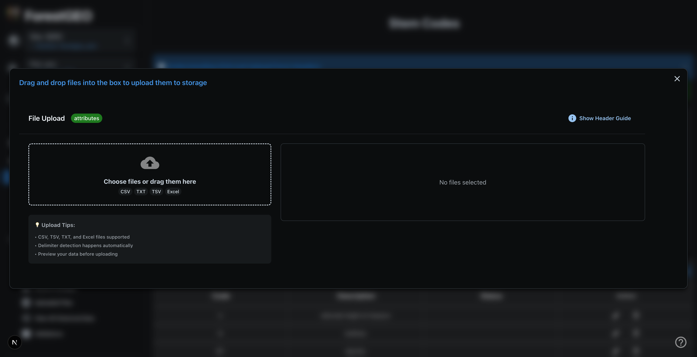
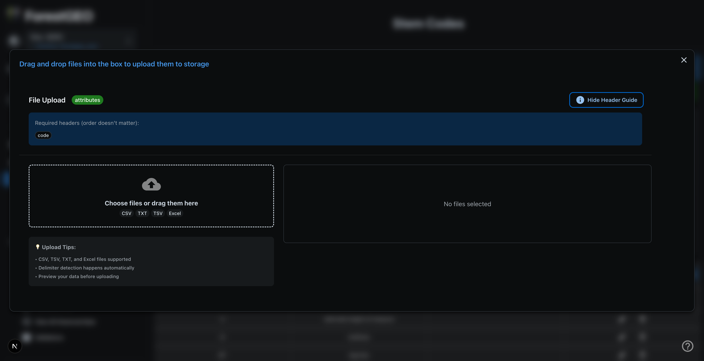

The file upload system is a multi-stage process that handles data parsing, validation, database insertion, and cloud backup. This guide explains each stage in detail.

---

## Overview

The upload cycle follows this general flow:

```
[Select File] → [Parse & Preview] → [Upload to Database] → [Validate] → [Azure Backup] → [Complete]
                                          ↓
                             [Failed Rows] → [Review & Fix] → [Reingest]

[Select File]
      ↓
[Parse & Preview]
      ↓
[Upload to Database]
      ↓
[Azure Backup]
      ↓
[Complete]
```

The core cycle is the same for all data types, but **measurements** have additional processing steps due to their complexity.

---

## Important Notes Before Uploading

:::caution
**Read before uploading!**
:::

1. **Update-forward behavior**: The system ALWAYS tries to update existing data rather than ignoring duplicates. If you upload a file with existing records, those records will be updated.

2. **Don't navigate away**: The upload cycle triggers system updates. **Do not** navigate away, reload the page, or close the browser while an upload is in progress!

3. **Large files**: Files with 50,000+ rows may take several minutes. Monitor the progress bar and estimated time.

4. **File format**: Only CSV, TSV, and TXT files are accepted. UTF-8 encoding is recommended.

---

## Stage 1: Reviewing Headers & File Dropzone

When you click the Upload button, you'll see the file upload interface:




### Understanding the Headers Accordion

Click on **Understanding the Headers** to see the column requirements for the form type:




This accordion shows:

- **Required headers** (marked with asterisk or bold)
- **Optional headers**
- **Data type requirements** for each column
- **Example values**

:::tip
Review this before uploading to ensure your file headers match the expected format.
:::

### Uploading Your File

You have two options:

1. **Drag and drop** your file into the dropzone
2. **Click** the dropzone to open a file browser

The system automatically detects:

- **File format** (CSV, TSV, TXT)
- **Delimiter** (comma, tab, semicolon)
- **Encoding** (UTF-8, etc.)

---

## Stage 2: Data Preview & Processing

After selecting a file, you'll see:

1. **Parsing progress** - The file is read and parsed
2. **Data preview** - A sample of parsed rows is displayed
3. **Header validation** - The system checks for required headers

If there are parsing issues, you'll see warnings here. Common issues:

- Missing required headers
- Malformed rows
- Encoding problems

### Large File Handling

For large files, the system:

- Splits the file into **32KB chunks**
- Processes chunks in parallel
- Shows a progress bar with **ETC** (Estimated Time to Completion)

---

## Stage 3: Database Upload

The parsed data is uploaded to the database. During this stage:

- A progress bar shows upload completion percentage
- The ETC updates as processing continues
- Rows are inserted or updated in batches

:::caution
**Do not close the browser or navigate away during this stage!**
:::

---

## Stage 4: Pre-processing Error Review

After upload completes, you'll see the completion view:


### Understanding Pre-processing Errors

This view shows rows that **failed pre-processing**:

| Error Type             | Cause                             | Example               |
| ---------------------- | --------------------------------- | --------------------- |
| Missing required field | A required column is empty        | Empty `tag` value     |
| Invalid data type      | Value doesn't match expected type | Text in numeric field |
| Parsing failure        | Row couldn't be parsed            | Malformed CSV syntax  |

:::note
Pre-processing errors are different from **validation errors**. Pre-processing errors prevent the row from being uploaded at all.
:::

### Downloading Failed Rows

Click **Download All Rows as CSV** to get:

- All failed rows in a form-friendly format
- An additional **Error Description** column explaining each failure

To fix and re-upload:

1. Download the failed rows
2. Fix the issues in the CSV
3. Remove the Error Description column
4. Re-upload the corrected file

---

## Stage 5: Azure Backup & Completion

### Automatic Cloud Backup

All uploaded files are automatically backed up to Azure Blob Storage. This provides:

- **File history** - Access previously uploaded files
- **Disaster recovery** - Files are preserved if local copies are lost
- **Audit trail** - Track what was uploaded and when

### Accessing Uploaded Files

Navigate to **Census Hub → Uploaded Files** to:

- View all uploaded files
- Download original files
- See upload timestamps and metadata

---

## Stage 6: System Refresh

After clicking **Confirm**, the system:

1. Refreshes application state
2. Updates cached data
3. Redirects you back to the data grid

You should see your newly uploaded data in the grid.

---

## Uploading Measurements (Additional Steps)

Measurements uploads follow the same cycle but include **additional stages** due to their complexity.

:::caution
Remember: You can **only** upload measurements after adding at least one record to each Fixed Data type (Stem Codes, Personnel, Quadrats, Species).
:::

### Why Measurements Are Different

A measurement row references multiple database tables:

| Field     | Description                           | Source Table                 |
| --------- | ------------------------------------- | ---------------------------- |
| `tag`     | Tree tag (unique ID)                  | `trees`                      |
| `stemtag` | Stem tag (unique ID)                  | `stems`                      |
| `spcode`  | Species code                          | `species`                    |
| `quadrat` | Quadrat name                          | `quadrats`                   |
| `lx`      | X-coordinate within quadrat           | `stems`                      |
| `ly`      | Y-coordinate within quadrat           | `stems`                      |
| `dbh`     | Diameter at breast height             | `coremeasurements`           |
| `hom`     | Height of measurement                 | `coremeasurements`           |
| `date`    | Measurement date                      | `coremeasurements`           |
| `codes`   | Attribute codes (semicolon-separated) | `cmattributes`, `attributes` |

This complexity requires a **two-step ingestion process**.

---

### Stage 1.5: Staging & Ingestion

For measurements, the upload splits into two steps:

```
Step 1: Upload to Staging Table
           ↓
Step 2: SQL Ingestion to Source Tables
```

**Step 1: Staging**

- Raw data is uploaded to a temporary staging table
- This is fast and allows the UI to remain responsive

**Step 2: Ingestion**

- SQL procedures process the staging data
- Records are distributed to the correct tables (trees, stems, coremeasurements, etc.)
- References are resolved (species codes → species IDs, etc.)

You'll see additional progress indicators during ingestion.

---

### Stage 2.5: Automatic Validation

After measurements are ingested, **validation procedures run automatically**:

1. Growth validations (DBH change limits)
2. Species validations (valid codes, consistency)
3. Location validations (coordinates within plot)
4. Duplicate detection

You'll see validation progress bars during this stage.

:::note
Validation errors do **not** prevent data from being saved. Data is saved but flagged for review.
:::

See [Validations & Statistics](/ForestGEO/validations-statistics/) for details on validation rules.

---

### Stage 4.5: Failed Measurements System

Rows that fail ingestion are **not silently dropped**. They are written into the main `coremeasurements` table with `StemGUID = NULL` so the app can tell them apart from successful rows, and the original CSV codes are preserved in the `RawCodes` column.

:::note
**Architecture change (Feb 2026):** There is no longer a separate `failedmeasurements` table. Successful and failed rows now live together in `coremeasurements`. Failed rows keep the **same row ID** through corrections, so audit history follows the row across reingestion attempts.
:::

**Common failure reasons:**

| Reason | Cause | Solution |
|---|---|---|
| Species not found | `spcode` doesn't exist in Species List | Add the species, then reingest |
| Quadrat not found | `quadrat` doesn't exist in Quadrats | Add the quadrat, then reingest |
| Invalid tree/stem reference | Tag combination doesn't exist | Check tag numbers |
| Duplicate record (within batch) | Same identity appears twice in your file | Remove the duplicate row |
| Invalid attribute codes | Code isn't in the Attributes list | **Soft warning** as of April 2026 — the row goes in, the code is flagged |

### Where to see failed rows

- **View Data → Measurements** — inline alongside successful rows, with a status filter for "failed only".
- **View Errors** — every row with a consolidated failure reason and the original CSV codes side-by-side.
- **Failed Measurements modal** — pops up automatically right after an upload if anything failed.

### Reingesting failed rows

1. **Review** the failure reasons in the modal or View Errors.
2. **Fix** the underlying issue (add missing reference data, or correct the row).
3. Click **Reingest All** to push everything back through `bulkingestionprocess`, or use the row-level reingest for one-offs.
4. Rows that now pass move out of the failed state; rows that still fail come back with **updated** reasons.

:::tip
Reingestion replays the data the app already has — you don't need to re-upload the file.
:::

See **[Failed Measurements Guide](/ForestGEO/errors/failed-measurements-guide/)** for the full triage workflow.

---

## Revision Upload (correcting an ingested census)

**Available since April 2026.** Revision Upload is a second upload mode designed for **correcting specific rows in a census that's already ingested** — you don't have to wipe the data and start over.

### When to use Revisions vs. Clean Re-upload

- Use **Revisions** when the rows you want to fix are already in the database.
- Use **Clean Re-upload** when you want to wipe the census and start from scratch.

### The Revision Upload flow

```
Export CSV → Edit only the values you want changed → Upload as Revisions →
Review match screen (tabs) → Apply
```

1. **Export** the current measurements from the data grid (the export keeps `StemGUID`, which is how rows are matched on the way back in).
2. **Edit** only the cells you want to change. Blank or unchanged cells mean "don't change" — they will not overwrite the database.
3. From the upload page, choose **Measurements → Revisions** and upload the edited file.
4. The app shows a **multi-tab review screen** before any write — see below.
5. Click **Apply**. All updates, deletions, and inserts run in a single transaction.

### The review screen tabs

| Tab | What's in it | What happens on Apply |
|---|---|---|
| **Changes** | Rows where one or more of the editable fields differs from the DB | Updated in place |
| **Duplicate Cleanup** | Rows that match multiple measurements for the same stem (typically legacy) | Highest-ID row wins; others deleted |
| **New Rows** | Rows that don't match anything in the census | Inserted **only if you explicitly confirm** |
| **Ignored Edits** | Rows where you edited a column Revisions can't update yet | No DB write — surfaced so you don't think they succeeded |
| **Unchanged** | Matched rows with no field differences | Skipped on Apply |
| **Invalid** | Rows the app can't safely handle (missing match key, stem in a different plot, etc.) | Not touched |

### Editable fields (Phase 1)

You can change these five fields through a Revision Upload:

- **DBH** (`MeasuredDBH` / `dbh`)
- **HOM** (`MeasuredHOM` / `hom`)
- **Measurement Date** (`MeasurementDate` / `date`)
- **Codes** (`RawCodes` / `codes`)
- **Comments** (`Description` / `comments`)

Edits to `SpeciesCode`, `QuadratName`, `StemLocalX`, `StemLocalY`, `TreeTag`, or `StemTag` are **not** applied through Revisions — they appear in the **Ignored Edits** tab so you can see what wasn't written. To change those columns, use inline editing in the grid.

### Common pitfalls

- **Spreadsheet apps strip leading zeros.** Open the CSV in a plain text editor for safety. The app tolerates this for tags and quadrat names but not for species codes.
- **`RawCodes` wins over `Attributes`.** If both columns are present, the raw codes are authoritative.
- **A blank cell means "don't change," not "set to NULL."** To clear a value, edit in the grid directly.
- **Revisions cannot be undone from the UI.** If you applied a bad revision, fix it with another Revision Upload.

### Checklist before Apply

- The correct **plot and census** are selected in the app.
- The **Changes** tab lists only the edits you intended.
- The **Ignored Edits** tab is empty, or you've accepted every entry.
- The **New Rows** tab is empty, or every entry is something you genuinely want created.
- The **Invalid** tab is empty, or you understand why each row is rejected.

---

---

## Upload Process Summary

### For Fixed Data (Attributes, Personnel, Quadrats, Species)

```
1. Select File
2. Parse & Preview
3. Upload to Database
4. Review Pre-processing Errors (if any)
5. Azure Backup
6. Complete
```

### For Measurements (initial upload)

```
1. Select File
2. Parse & Preview
3. Upload to Staging Table
4. SQL Ingestion Processing
5. Automatic Validation
6. Review Pre-processing Errors
7. Review Failed Measurements (in coremeasurements with StemGUID=NULL)
8. Azure Backup
9. Complete
```

### For Measurements (Revision Upload)

```
1. Export current data from grid
2. Edit only the fields you want changed
3. Upload as Measurements → Revisions
4. Review tabs: Changes / Duplicates / New Rows / Ignored Edits / Invalid
5. Apply (single transaction)
6. Validations re-run on affected rows
7. Grid refreshes automatically
```

---

## Troubleshooting Upload Issues

### Upload Stuck at 0%

- Check your internet connection
- Try a smaller file first
- Refresh the page and retry

### Progress Bar Freezes

- Large files may pause while processing batches
- Wait at least 5 minutes before assuming it's stuck
- If truly stuck, refresh and retry

### "Headers not recognized"

- Check header names match exactly (case-insensitive)
- Remove extra spaces from headers
- Ensure first row contains headers (not data)

### Upload Completes but No Data Appears

- Check you're viewing the correct census
- Refresh the data grid
- Check Failed Measurements for ingestion errors

### File Too Large

- Split into multiple files (50,000 rows or less each)
- Upload in batches
- Try during off-peak hours
