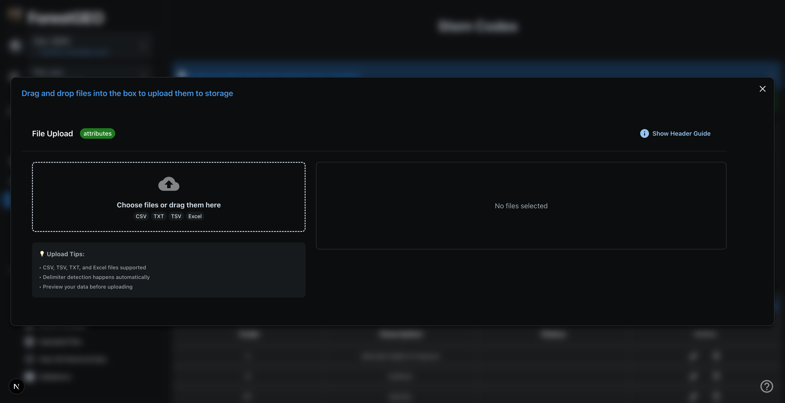
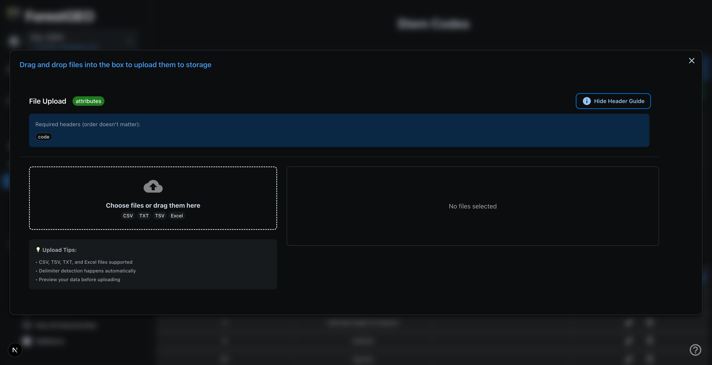
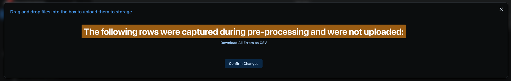

The file upload system is a multi-stage process that handles data parsing, validation, database insertion, and cloud backup. This guide explains each stage in detail.

---

## Overview

The upload cycle follows this general flow:

```
[Choose Mode] → [Select File] → [Upload to Database] → [Azure Backup] → [Complete]
                                         ↓
                          [Validations run in the background]
                                         ↓
                       [Unresolved rows → Census Hub → View Errors]
```

Validation no longer blocks the upload: once your rows are written, the validation pass is
started in the background and the upload proceeds to backup and completion. Anything it finds
waits for you under View Errors.

The core cycle is the same for all data types, but **measurements** have additional processing steps due to their complexity.

---

## Important Notes Before Uploading

:::danger
**Clean Re-Upload deletes data.** It is one of the two upload modes, and it is the mode the
system falls back to if a mode is not explicitly chosen. Read the next section before you
upload anything into a census that already holds data.
:::

1. **Choose your upload mode deliberately**: Every upload begins by asking you to pick a mode. **Clean Re-Upload** replaces existing data by deleting it first. **Revisions Upload** corrects specific rows and leaves everything else alone. See [Stage 0](#stage-0-choosing-an-upload-mode) below.

2. **Don't navigate away**: The upload cycle triggers system updates. **Do not** navigate away, reload the page, or close the browser while an upload is in progress! (Sites enabled for background uploads are the exception — see [Background uploads](#background-uploads) below.)

3. **Large files**: A single file may be up to 500 MB, and one upload may total up to 1 GB across all selected files. Large files take several minutes — monitor the progress bar.

4. **File format**: CSV, TSV, and TXT files are accepted, and the delimiter is detected automatically (comma, tab, semicolon, or pipe). Save your file as UTF-8. ArcGIS Field Maps workbooks (`.xlsx`) use a separate import path with its own preflight check.

---

## Stage 0: Choosing an Upload Mode

Every upload — for measurements and for every other data type — opens with a **Choose Upload
Mode** screen. You cannot skip it, and the choice determines whether existing data survives.

### Clean Re-Upload

Marked **Destructive** in the application, and shown with a red warning for good reason.

The uploaded file becomes the new source of truth for whatever you are uploading. Before
inserting your rows, the system **deletes the data already there**:

- For **measurements**, every prior measurement in the selected census is removed — both
  successfully ingested rows and unresolved failed rows — along with their recorded errors and
  upload metrics.
- For **fixed data** such as species or stem codes, all currently active records of that type
  are removed.

Use this when you are loading a census for the first time, or when you genuinely intend to
replace a census wholesale and have confirmed nothing else depends on the current rows.

:::caution
Clean Re-Upload cannot be undone from the interface. If you are correcting a handful of rows in
a census that is already loaded, this is **not** the mode you want.
:::

### Revisions Upload

Marked **Recommended**. You supply a small file containing only the rows you want to change.
The system matches each row against the existing census, shows you exactly what would change,
and writes nothing until you confirm. Nothing outside your file is touched.

This is the right mode for correcting mistakes in a census that has already been ingested. It
is covered in detail under [Revision Upload](#revision-upload-correcting-an-ingested-census) below.

---

## Stage 1: Reviewing Headers & File Dropzone

Once you have chosen a mode, you'll see the file upload interface:



### Understanding the Headers Accordion

Click on **Understanding the Headers** to see the column requirements for the form type:



This accordion shows:

- **Required headers** (marked with asterisk or bold)
- **Optional headers**
- **Data type requirements** for each column
- **Example values**

:::tip
Review this before uploading to ensure your file headers match the expected format.
:::

### Uploading Your File

You have two options:

1. **Drag and drop** your file into the dropzone
2. **Click** the dropzone to open a file browser

The system automatically detects:

- **File format** (CSV, TSV, TXT)
- **Delimiter** — comma, tab, semicolon, or pipe

:::note
Encoding is **not** detected. Save your file as UTF-8 before uploading, or accented characters in
species names and comments may arrive corrupted.
:::

### Matching your headers

Parsing and header checking happen on this same screen — there is no separate preview step to
click through. Your headers are matched leniently: capitalisation, spaces, underscores and
hyphens are ignored, and common alternatives are recognised (`species` or `sp` for `spcode`,
`diameter` for `dbh`, `quad` for `quadrat`, and so on).

For measurements files, if any header still cannot be matched, a **column mapping dialog** opens
and asks you to pair each unmatched column with a field by hand. **Continue Upload** stays
disabled until every required field is accounted for, so a greyed-out button here means the
mapping is still incomplete rather than that something has gone wrong.

:::caution
A CSV column whose name merely resembles a field is **not** adopted automatically — if you do not
map it, it is ignored. Check the mapping rather than assuming a near-miss header was understood.
:::

### Large File Handling

For large files, the system:

- Splits the file into **256KB chunks**
- Processes those chunks **one at a time**, deliberately — running them concurrently caused
  duplicate insertions, so the sequential path is a correctness guarantee rather than a limitation
- Shows a progress bar with **ETC** (Estimated Time to Completion)

---

## Stage 3: Database Upload

The parsed data is uploaded to the database. During this stage:

- A progress bar shows upload completion percentage
- The ETC updates as processing continues
- Rows are inserted or updated in batches

:::caution
**Do not close the browser or navigate away during this stage!**
:::

---

## Stage 4: Rows That Could Not Be Resolved

After upload completes, you'll see the completion view:



The completion screen reports the outcome and refreshes the application's data; it does not list
individual problem rows. Reviewing those is a separate step.

### What "could not be resolved" means

Some rows are written but cannot be attached to a stem — a species code that isn't in your
Species List, a quadrat name that matches nothing, missing coordinates. These are **not** thrown
away. They stay in the census with their original CSV values preserved, waiting for you under
**Census Hub → View Errors**.

| Cause                     | Example                                        |
| ------------------------- | ---------------------------------------------- |
| Missing required field    | Empty `tag`, `lx`, or `ly` value                |
| Unknown reference         | Species code or quadrat name not defined yet    |
| Ambiguous reference       | A quadrat name matching two active quadrats     |
| Duplicate tags in the file | The same tree/stem tag pair appearing twice     |

:::note
These are different from **validation findings**. A row that fails validation was still resolved
and ingested; a row here was not, and shows `StemGUID = NULL` if you query the database directly.
:::

### Fixing them

1. Open **Census Hub → View Errors** and read the consolidated reason on each row.
2. Add whatever was missing — usually a species, quadrat, or stem code.
3. Correct the rows inline in the grid, or re-submit just those rows as a **Revisions** upload.

:::caution
If the reason is `INTERRUPTED_UPLOAD`, the row was never actually rejected — the upload timed out
or was cancelled before reaching it. Re-run the upload rather than editing the data.
:::

---

## Stage 5: Azure Backup & Completion

### Automatic Cloud Backup

All uploaded files are automatically backed up to Azure Blob Storage. This provides:

- **File history** - Access previously uploaded files
- **Disaster recovery** - Files are preserved if local copies are lost
- **Audit trail** - Track what was uploaded and when

### Accessing Uploaded Files

Navigate to **Census Hub → Uploaded Files** to:

- View all uploaded files
- Download original files
- See upload timestamps and metadata

---

## Stage 6: System Refresh

The refresh starts on its own as soon as the completion screen appears — there is nothing to
click to begin it. A progress indicator tracks it while the system:

1. Refreshes application state
2. Updates cached data

When it finishes, click **Close** to dismiss the upload window. You are returned to the grid you
started from, with your newly uploaded data in place.

---

## Uploading Measurements (Additional Steps)

Measurements uploads follow the same cycle but include **additional stages** due to their complexity.

:::caution
Remember: You can **only** upload measurements after adding at least one record to each Fixed Data type (Stem Codes, Personnel, Quadrats, Species).
:::

### Why Measurements Are Different

A measurement row references multiple database tables:

| Field     | Description                           | Source Table                 |
| --------- | ------------------------------------- | ---------------------------- |
| `tag`     | Tree tag (unique ID)                  | `trees`                      |
| `stemtag` | Stem tag (unique ID)                  | `stems`                      |
| `spcode`  | Species code                          | `species`                    |
| `quadrat` | Quadrat name                          | `quadrats`                   |
| `lx`      | X-coordinate within quadrat           | `stems`                      |
| `ly`      | Y-coordinate within quadrat           | `stems`                      |
| `dbh`     | Diameter at breast height             | `coremeasurements`           |
| `hom`     | Height of measurement                 | `coremeasurements`           |
| `date`    | Measurement date                      | `coremeasurements`           |
| `codes`   | Attribute codes (semicolon-separated) | `cmattributes`, `attributes` |

This complexity requires a **two-step ingestion process**.

---

### Stage 1.5: Staging & Ingestion

For measurements, the upload splits into two steps:

```
Step 1: Upload to Staging Table
           ↓
Step 2: SQL Ingestion to Source Tables
```

**Step 1: Staging**

- Raw data is uploaded to a temporary staging table
- This is fast and allows the UI to remain responsive

**Step 2: Ingestion**

- SQL procedures process the staging data
- Records are distributed to the correct tables (trees, stems, coremeasurements, etc.)
- References are resolved (species codes → species IDs, etc.)

You'll see additional progress indicators during ingestion.

---

### Background uploads

By default an upload runs while you watch it, which is why the warning above tells you not to
navigate away.

Some sites are enabled for **background uploads** instead. Where that applies, your file is handed
to a job that continues on the server, and the page shows the job's progress rather than the
upload's — you can leave the page and come back to it. Whether you get this path depends on
configuration set by an administrator, per site and per account, so it is normal for one colleague
to see it and another not to.

If you are unsure which applies to you, treat the warning above as authoritative and stay on the
page until the upload completes. Nothing is lost either way.

---

### Importing from ArcGIS Field Maps

If your crews collect in ArcGIS Field Maps, you do not need to flatten the export to CSV first.
The measurements grid has a separate **Import ArcGIS** button that accepts the workbook directly.

- It takes **exactly one `.xlsx` workbook** — not a CSV, and not several files at once.
- The workbook is expected to hold two sheets: a **trees** sheet and a **stems** sheet. Each stem
  links back to its tree by GlobalID, which is how multi-stemmed trees survive the import.
- Coordinates on the trees sheet are read verbatim, so they must already be quadrat-local.
- A **preflight** step runs before anything is written, reporting what it found in each sheet and
  which required columns are missing, so you can correct the workbook and try again.

Like a CSV upload, an ArcGIS import asks you to choose a mode first — and Clean Re-Upload here
means the same thing it means everywhere else: the census's existing measurements are deleted
before the workbook is inserted.

---

### Automatic Validation

Once measurements are ingested, the configurable validation procedures are started **in the
background**. They cover growth and shrinkage limits, species and attribute codes, coordinates
and cross-census position, duplicate tags, and species-specific DBH bounds.

Because they no longer sit in the upload's path, there is no validation screen and no progress
bar for this — the upload moves straight on to backup and completion. Check **Census Hub → View
Errors** afterwards to see what the pass turned up.

:::note
Validation errors do **not** prevent data from being saved. Data is saved but flagged for review.
:::

See [Validations & Statistics](/ForestGEO/validations-statistics/) for details on validation rules.

---

### Stage 4.5: Failed Measurements System

Rows that fail ingestion are **not silently dropped**. They are written into the main `coremeasurements` table with `StemGUID = NULL` so the app can tell them apart from successful rows, and the original CSV codes are preserved in the `RawCodes` column.

:::note
**Architecture change (Feb 2026):** There is no longer a separate `failedmeasurements` table. Successful and failed rows now live together in `coremeasurements`. Failed rows keep the **same row ID** through corrections, so audit history follows the row across reingestion attempts.
:::

**Common failure reasons:**

| Reason | Cause | Solution |
|---|---|---|
| Species not found | `spcode` doesn't exist in Species List | Add the species, then reingest |
| Quadrat not found | `quadrat` doesn't exist in Quadrats | Add the quadrat, then reingest |
| Invalid tree/stem reference | Tag combination doesn't exist | Check tag numbers |
| Duplicate record (within batch) | Same identity appears twice in your file | Remove the duplicate row |
| Invalid attribute codes | Code isn't in the Attributes list | **Soft warning** as of April 2026 — the row goes in, the code is flagged |

### Where to see failed rows

- **Census Hub → View Errors** — the main place to work: every row with a consolidated failure reason and the original CSV codes side-by-side.
- **Census Hub → View Data** — failed rows inline alongside successful ones, with a status filter for "failed only".

### Correcting failed rows

1. **Review** the failure reasons under View Errors.
2. **Fix** the underlying issue — add the missing reference data, or correct the row.
3. **Re-submit** the affected rows as a **Revisions** upload, or edit them inline in the grid.
4. Rows that now pass move out of the failed state; rows that still fail reappear with **updated** reasons.

:::note
A row keeps its original ID through this loop, so its audit history survives however many
correction passes it takes.
:::

See **[Failed Measurements Guide](/ForestGEO/errors/failed-measurements-guide/)** for the full triage workflow.

---

## Revision Upload (correcting an ingested census)

**Available since April 2026.** Revision Upload is a second upload mode designed for **correcting specific rows in a census that's already ingested** — you don't have to wipe the data and start over.

### When to use Revisions vs. Clean Re-upload

- Use **Revisions** when the rows you want to fix are already in the database.
- Use **Clean Re-upload** when you want to wipe the census and start from scratch.

### The Revision Upload flow

```
Export CSV → Edit only the values you want changed → Upload as Revisions →
Review match screen (tabs) → Apply
```

1. **Export** the current measurements from the data grid (the export keeps `StemGUID`, which is how rows are matched on the way back in).
2. **Edit** only the cells you want to change. Blank or unchanged cells mean "don't change" — they will not overwrite the database.
3. From the upload page, choose **Measurements → Revisions** and upload the edited file.
4. The app shows a **multi-tab review screen** before any write — see below.
5. Click **Apply**. All updates, deletions, and inserts run in a single transaction.

### The review screen tabs

| Tab | What's in it | What happens on Apply |
|---|---|---|
| **Changes** | Rows where one or more of the editable fields differs from the DB | Updated in place |
| **Duplicate Cleanup** | Rows that match multiple measurements for the same stem (typically legacy) | Highest-ID row wins; others deleted |
| **New Rows** | Rows that don't match anything in the census | Inserted **only if you explicitly confirm** |
| **Unchanged** | Matched rows with no field differences | Skipped on Apply |
| **Invalid** | Rows the app can't safely handle (missing match key, stem in a different plot, etc.) | Not touched |

Only **Changes** is always present. The other tabs appear only when they have something in them,
so a clean revision file will show fewer tabs than this table lists.

### Editable fields

A Revision Upload can change eleven fields. Five of them anyone with upload access may edit:

- **DBH** (`MeasuredDBH` / `dbh`)
- **HOM** (`MeasuredHOM` / `hom`)
- **Measurement Date** (`MeasurementDate` / `date`)
- **Codes** (`RawCodes` / `codes`)
- **Comments** (`Description` / `comments`)

The remaining six identify the stem, so they are restricted to **global** and **database
administrator** accounts:

- **Species Code** (`spcode`)
- **Quadrat Name** (`quadrat`)
- **Local X** and **Local Y** (`lx`, `ly`)
- **Tree Tag** and **Stem Tag** (`tag`, `stemtag`)

If your account lacks the role, the review screen blocks the upload with a message naming the
row and field rather than applying part of it. Ask an administrator to run the revision, or make
the change through inline editing in the grid.

### Common pitfalls

- **Spreadsheet apps strip leading zeros.** Open the CSV in a plain text editor for safety. The app tolerates this for tags and quadrat names but not for species codes.
- **`RawCodes` wins over `Attributes`.** If both columns are present, the raw codes are authoritative.
- **A blank cell means "don't change," not "set to NULL."** To clear a value, edit in the grid directly.
- **Revisions cannot be undone from the UI.** If you applied a bad revision, fix it with another Revision Upload.

### Checklist before Apply

- The correct **plot and census** are selected in the app.
- The **Changes** tab lists only the edits you intended.
- The **New Rows** tab is empty, or every entry is something you genuinely want created.
- The **Duplicate Cleanup** tab is empty, or you accept that the highest-ID row wins in each group.
- The **Invalid** tab is empty, or you understand why each row is rejected.

---

---

## Upload Process Summary

### For Fixed Data (Attributes, Personnel, Quadrats, Species)

```
1. Select File
2. Parse & Preview
3. Upload to Database
4. Review Pre-processing Errors (if any)
5. Azure Backup
6. Complete
```

### For Measurements (initial upload)

```
1. Choose Upload Mode
2. Select File (headers matched; column mapping if needed)
3. Upload to Staging Table
4. SQL Ingestion Processing
5. Validation started in the background
6. Azure Backup
7. Complete
8. Review unresolved rows under Census Hub → View Errors
   (they sit in coremeasurements with StemGUID = NULL)
```

### For Measurements (Revision Upload)

```
1. Export current data from grid
2. Edit only the fields you want changed
3. Upload as Measurements → Revisions
4. Review tabs: Changes / Duplicate Cleanup / New Rows / Unchanged / Invalid
5. Apply (single transaction)
6. Validations re-run on affected rows
7. Grid refreshes automatically
```

---

## Troubleshooting Upload Issues

### Upload Stuck at 0%

- Check your internet connection
- Try a smaller file first
- Refresh the page and retry

### Progress Bar Freezes

- Large files may pause while processing batches
- Wait at least 5 minutes before assuming it's stuck
- If truly stuck, refresh and retry

### "Headers not recognized"

- Check header names match exactly (case-insensitive)
- Remove extra spaces from headers
- Ensure first row contains headers (not data)

### Upload Completes but No Data Appears

- Check you're viewing the correct census
- Refresh the data grid
- Check Failed Measurements for ingestion errors

### File Too Large

The limits are 500 MB for a single file and 1 GB across all files in one upload.

- Split the data into several smaller files and upload them in batches
- Remove columns the app does not read before exporting from your spreadsheet
- Try during off-peak hours
