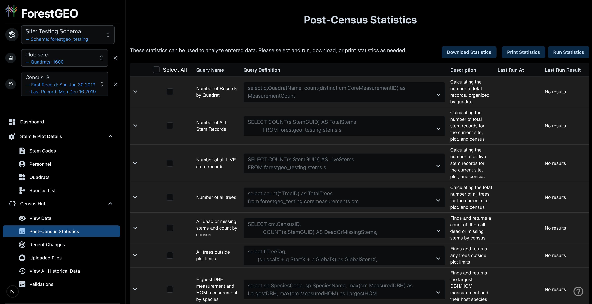

A key part of this application is the **Validations** and **Statistics** systems. These tools help ensure data quality and provide insights into your census data.

---

## Overview

| System                     | Purpose                                          | When It Runs                            |
| -------------------------- | ------------------------------------------------ | --------------------------------------- |
| **Validations**            | Check data quality and flag potential errors     | In the background, after measurements upload |
| **Post-Census Statistics** | Analyze census data and generate summary reports | Manually triggered by user              |

---

## The Validations System

The validation system performs automated checks on your measurement data to identify potential errors and data quality issues.

### How Validations Work

1. **After Upload**: Once your measurements are ingested, the validation pass starts in the background — it does not hold up the upload
2. **Error Flagging**: Records that fail validation are flagged but **still saved** to the database
3. **Review & Fix**: You can review flagged records in the data grid and correct them
4. **Re-validation**: Corrections are re-validated to clear the error flags

:::note
Validation errors do **not** prevent your data from being saved. Data is saved but flagged for review, allowing you to fix issues after upload.
:::

### Accessing the Validations Page

Navigate to **Census Hub → Validations** to:

- View all available validation rules
- See which validations are enabled or disabled
- View the SQL query behind each validation
- Enable or disable specific validations
- Add a new validation of your own

:::caution
**This page is restricted to database administrators and global users.** Everyone else gets a
full-page "Access Denied" rather than a read-only view, so if you simply want to know why a row
was flagged, use **Census Hub → View Errors** instead — that is available to everyone.
:::

### Available Validations

The following table lists all validation checks and their default status:

| Validation Name                                                   | Description                                                              | Default State |
| ----------------------------------------------------------------- | ------------------------------------------------------------------------ | ------------- |
| **ValidateDBHGrowthExceedsMax**                                   | Flag DBH measurements showing more than 65mm growth from previous census | Enabled       |
| **ValidateDBHShrinkageExceedsMax**                                | Flag DBH measurements showing more than 5% decrease from previous census | Enabled       |
| **ValidateFindAllInvalidSpeciesCodes**                            | Flag stems with species codes not defined in the Species List            | Enabled       |
| **ValidateFindDuplicatedQuadratsByName**                          | Flag quadrats with duplicate names within a plot                         | Enabled       |
| **ValidateFindDuplicateStemTreeTagCombinationsPerCensus**         | Flag tree/stem combinations recorded more than once in the same census   | Enabled       |
| **ValidateFindMeasurementsOutsideCensusDateBoundsGroupByQuadrat** | Flag measurements with dates outside the census date range               | Enabled       |
| **ValidateFindStemsInTreeWithDifferentSpecies**                   | Flag stems on the same tree with different species designations          | Enabled       |
| **ValidateFindStemsOutsidePlots**                                 | Flag stems with coordinates outside the plot boundaries                  | Enabled       |
| **ValidateFindTreeStemsInDifferentQuadrats**                      | Flag stems on the same tree assigned to different quadrats               | Enabled       |
| **ValidateScreenMeasuredDiameterMinMax**                          | Flag DBH measurements outside species-defined min/max bounds             | Enabled       |
| **ValidateScreenStemsWithMeasurementsButDeadAttributes**          | Flag stems marked as dead but still have measurements                    | **Disabled**  |
| **ValidateScreenStemsWithMissingMeasurementsButLiveAttributes**   | Flag live stems that are missing measurements                            | **Disabled**  |
| **ValidateFindInvalidAttributeCodes**                             | Flag attribute codes that don't exist in the Stem Codes list             | Enabled       |
| **ValidateFindAbnormallyHighDBH**                                 | Flag DBH above the absolute maximum threshold (3500 mm / 350 cm)         | Enabled       |
| **ValidateQuadratMismatchAcrossCensuses**                         | Flag a tag whose quadrat differs from the previous census                | Enabled       |
| **ValidateCoordinateDriftAcrossCensuses**                         | Flag a tag whose coordinates moved more than 10 m since the last census  | Enabled       |

### Understanding Validation Categories

#### Growth Validations

These check for biologically implausible growth patterns. **As of 2026, cross-census growth checks operate correctly** — earlier versions of the app had a comparison bug that has since been fixed.

- **Growth > 65mm**: Trees typically don't grow more than 65mm diameter between censuses
- **Shrinkage > 5%**: Trees rarely shrink significantly; large shrinkage often indicates measurement error
- **Abnormally high DBH** *(V15)*: A diameter above 3500 mm exceeds anything plausible and almost always means a unit or transcription error

#### Cross-Census Position Validations

These compare a tag against the same tag in the previous census:

- **Quadrat mismatch** *(V17)*: The same TreeTag/StemTag was recorded in a different quadrat last census — usually a transcription or tag-reuse error
- **Coordinate drift > 10 m** *(V18)*: The stem's recorded position moved more than ten metres between censuses

:::note
Validation IDs are not contiguous — 10, 16 and 19 are unused. Validation 16 was removed in 2026
because it duplicated a check already run inline during ingestion.
:::

#### Reference Data Validations

These ensure measurements reference valid supporting data:

- **Invalid Species Codes** *(V3)*: Species must exist in the Species List
- **Invalid Attribute Codes** *(V14)*: Attribute codes must exist in the Stem Codes list

#### Consistency Validations

These check for logical consistency:

- **Different Species Same Tree**: All stems on a tree must have the same species
- **Stems in Different Quadrats**: All stems on a tree must be in the same quadrat
- **Stems Outside Plot**: Coordinates must fall within plot boundaries

#### Duplicate Detection

These identify potential data entry errors:

- **Duplicate Tree/Stem Combos**: Each tag combination should appear only once per census
- **Duplicate Quadrat Names**: Quadrat names must be unique within a plot

### Viewing Validation Queries

Each validation is powered by a SQL query. To view the query:

1. Navigate to **Census Hub → Validations**
2. Find the validation you're interested in
3. Click the **dropdown/expand button** to reveal the SQL query

This is useful for understanding exactly what conditions trigger each validation.

### Enabling/Disabling Validations

As a database administrator or global user, you can enable or disable specific validations:

1. Navigate to **Census Hub → Validations**
2. Find the validation you want to modify
3. Toggle the **enable/disable switch**
4. Changes take effect on the next validation run

:::caution
Disabling validations may allow data quality issues to go undetected. Only disable validations if you have a specific reason and understand the implications.
:::

---

## Post-Census Statistics

The Post-Census Statistics page provides analytical tools to summarize and evaluate your census data after data collection is complete.

### Accessing Post-Census Statistics

Navigate to **Census Hub → Post-Census Statistics** to access this feature.

:::note
This page requires **manual triggering**. Unlike validations, statistics are not calculated automatically.
:::

### How to Run Statistics

1. Navigate to **Census Hub → Post-Census Statistics**
2. Review the available statistical queries — clicking a row expands it so you can read the SQL it will run
3. **Tick the checkbox** beside each statistic you want, then click **Run Statistics**
4. View the results in the expandable results panel

:::note
Selecting nothing and clicking Run Statistics does nothing except warn you to pick at least one.
The checkboxes, not the row itself, are what queue a query.
:::

### Available Statistics

Twelve queries ship with every site. Each one is a saved SQL statement you can read before you
run it, and sites can add their own alongside them.

#### Counts

| Statistic                             | Description                                       |
| ------------------------------------- | ------------------------------------------------- |
| **Number of Records by Quadrat**      | How many measurements landed in each quadrat       |
| **Number of ALL Stem Records**        | Every stem record in the census                    |
| **Number of all LIVE stem records**   | Stems currently recorded as alive                  |
| **Number of all trees**               | Distinct trees in the census                       |

#### Mortality and survivorship

| Statistic                                            | Description                                      |
| ---------------------------------------------------- | ------------------------------------------------ |
| **All dead or missing stems and count by census**     | Dead and missing stems, grouped by census        |
| **Number of dead stems per quadrat**                  | Where mortality is concentrated spatially        |
| **Number of dead stems by species**                   | Where mortality is concentrated taxonomically    |
| **Checks that all trees from the last census are present** | Trees in the previous census with no record in this one |

#### Recruitment

| Statistic                                                                       | Description                                  |
| ------------------------------------------------------------------------------- | -------------------------------------------- |
| **Number of new stems, grouped by quadrat, and then by census**                  | Where new stems appeared                     |
| **Determining which quadrats have the most and least number of new stems for the current census** | The extremes of that distribution |

#### Data checks

| Statistic                                                    | Description                                             |
| ------------------------------------------------------------ | ------------------------------------------------------- |
| **All trees outside plot limits**                             | Trees whose coordinates fall outside the plot boundary   |
| **Highest DBH measurement and HOM measurement by species**    | Useful for spotting unit errors and outliers per species |

### Interpreting Results

Statistics results are displayed in expandable panels showing:

- **Query name and description**
- **Result count**
- **Tabular data** with sortable columns
- **Download Statistics**, which saves the selected results as a JSON file
- **Print Statistics**, which opens a printable view

Both act only on the statistics you have ticked, not on everything on the page.

### When to Use Post-Census Statistics

Use this feature:

- **After completing data upload** to verify census completeness
- **Before finalizing a census** to identify any gaps
- **For reporting** to generate summary statistics for stakeholders
- **For quality assurance** to spot unexpected patterns

---

## Best Practices

### For Validations

1. **Review validation errors promptly** - Don't let flagged records accumulate
2. **Understand before disabling** - Know why a validation exists before turning it off
3. **Document exceptions** - If data legitimately fails validation, add a note in Comments
4. **Check the query** - Use the SQL query view to understand exactly what's being checked

### For Statistics

1. **Run after each upload batch** - Track progress during data collection
2. **Compare across censuses** - Look for unexpected changes from previous censuses
3. **Investigate anomalies** - Unusual statistics often indicate data issues
4. **Export for records** - Keep statistical summaries for documentation

---

## Troubleshooting

### Validation Errors Keep Appearing

If the same records keep failing validation:

1. Verify your fix was actually saved (refresh the page)
2. Check for case sensitivity in codes
3. Ensure you're in the correct plot/census context
4. Review the validation query to understand exact requirements

### Statistics Not Loading

If statistics fail to run:

1. Ensure you have a census selected
2. Check that measurements exist in the current census
3. Try refreshing the page
4. Contact administrator if the issue persists

### Missing Validations

If you don't see expected validations:

1. Check if they're disabled in the Validations page
2. Verify you have permission to view all validations
3. Contact administrator if validations appear to be missing
