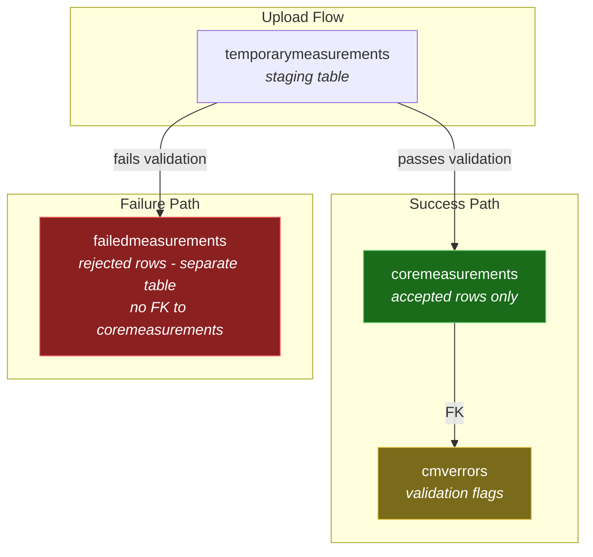
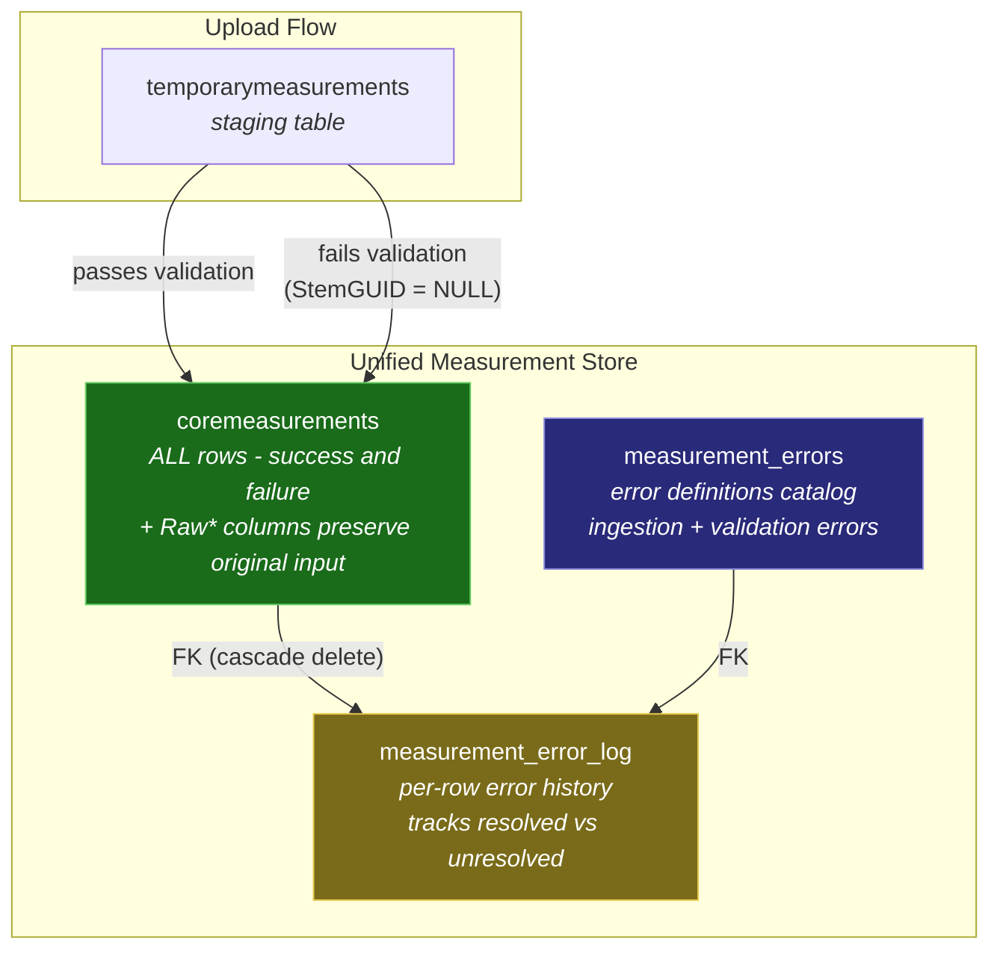
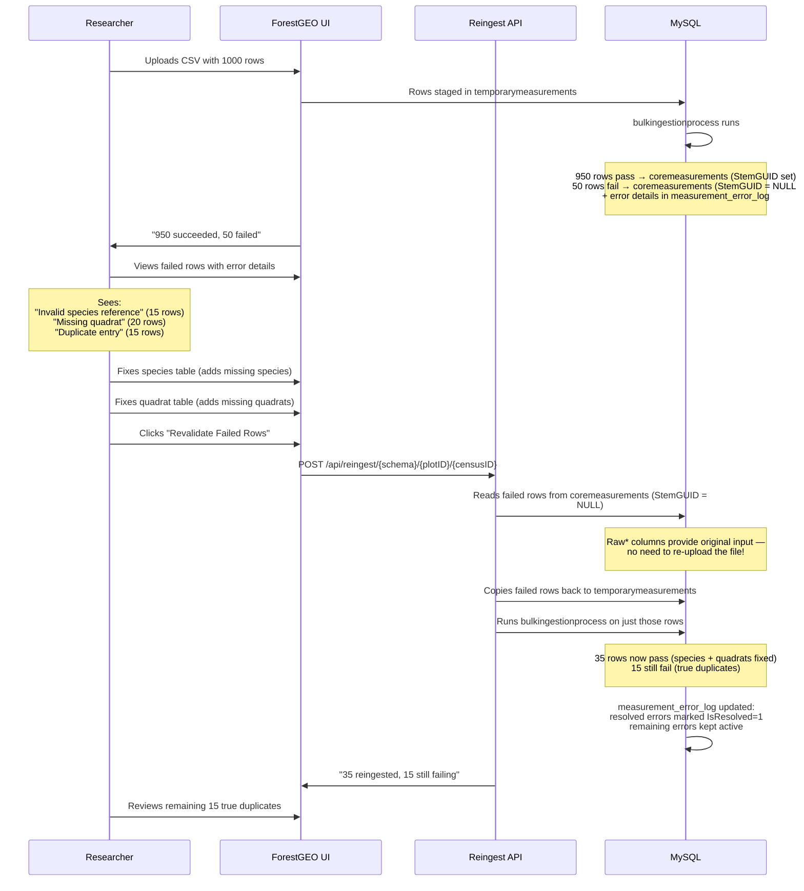
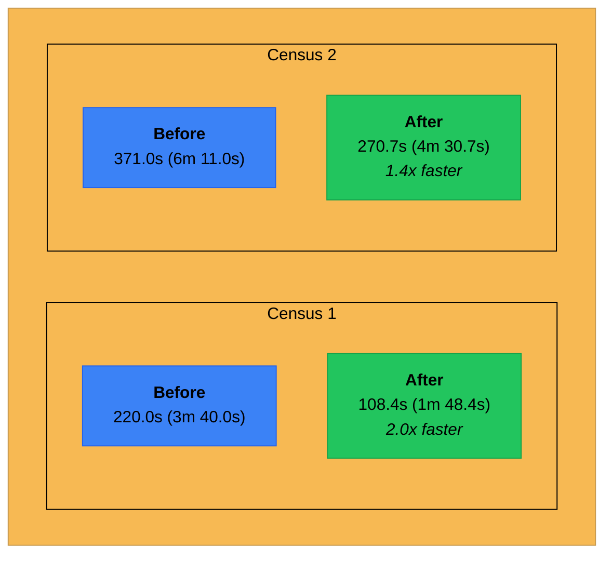

# Unified Measurements Table - Branch Overview

## 1. Architecture Diagram: Before & After

### Before (main)

Three separate tables, three separate concerns. Failed rows live in a completely different table with no FK back to the measurement that spawned them.



**Problems with this model:**
- Failed rows are **orphaned** in `failedmeasurements` with no link back to the measurement pipeline
- No way to track **error history** - once a row fails, you only see the latest reason
- Re-uploading a corrected file means **starting from scratch** - no continuity
- Exports only show successful data - **failed rows are invisible** to downstream analysis
- `cmverrors` uses a junction table to `sitespecificvalidations` - only covers **post-ingestion validation**, not ingestion-time failures

---

### After (unified-measurements-table)

One table for all measurements. Failed rows stay in `coremeasurements` (marked by `StemGUID = NULL`), with structured error tracking via `measurement_error_log`.



**Key differences:**
- **One table** for all measurements - failed rows are `coremeasurements` rows where `StemGUID IS NULL`
- `Raw*` columns (`RawTreeTag`, `RawStemTag`, `RawSpCode`, etc.) **preserve the original upload values** so reingestion can retry without the original file
- `measurement_errors` is a **catalog of all error types** (both ingestion and validation), replacing the old split between `failedmeasurements.FailureReasons` (free text) and `cmverrors` (FK to validations)
- `measurement_error_log` tracks **per-row error history** with `IsResolved` / `ResolvedAt` timestamps
- `UploadFileID`, `UploadBatchID`, `SourceRowIndex` on `coremeasurements` enable **full upload traceability**

---

## 2. Failed Row Lifecycle (Revalidation Flow)

This is the new capability that didn't exist before. Previously, a failed row was a dead end - fix your file and re-upload. Now:



---

## 3. Error Classification System

The old system had two completely different error representations. The new system unifies them:

### Before

| Error Source | Where Stored | Format | Queryable? |
|---|---|---|---|
| Ingestion failures (missing species, bad quadrat, etc.) | `failedmeasurements.FailureReasons` | Free-text blob | No - requires string parsing |
| Post-ingestion validation (DBH out of range, etc.) | `cmverrors` -> FK to `sitespecificvalidations` | Junction table with FK | Yes, but only for successful rows |

### After

| Error Source | Where Stored | Format | Queryable? |
|---|---|---|---|
| All errors (ingestion + validation) | `measurement_error_log` -> FK to `measurement_errors` | Structured rows with `ErrorSource`, `ErrorCode`, `ErrorMessage` | Yes - fully indexed and filterable |

### Error Code Catalog (new)

All errors now have machine-readable codes in `measurement_errors`:

| ErrorSource | ErrorCode | ErrorMessage |
|---|---|---|
| `ingestion` | `MISSING_FIELD_TREETAG` | Missing required field: TreeTag |
| `ingestion` | `MISSING_FIELD_STEMTAG` | Missing required field: StemTag |
| `ingestion` | `MISSING_FIELD_SPECIESCODE` | Missing required field: SpeciesCode |
| `ingestion` | `MISSING_FIELD_QUADRATNAME` | Missing required field: QuadratName |
| `ingestion` | `MISSING_FIELD_DATE` | Missing required field: MeasurementDate |
| `ingestion` | `INVALID_QUADRAT` | Invalid quadrat reference |
| `ingestion` | `INVALID_SPECIES` | Invalid species reference |
| `ingestion` | `DUPLICATE_ENTRY` | Duplicate measurement row detected |
| `ingestion` | `NEGATIVE_DBH` | DBH must be non-negative |
| `ingestion` | `NEGATIVE_HOM` | HOM must be non-negative |
| `ingestion` | `INVALID_COORDINATE` | Coordinate value is negative |
| `ingestion` | `FIELD_TOO_LONG` | One or more fields exceed column length limits |
| `ingestion` | `MISSING_MEASUREMENT_DATA` | Missing measurement data |
| `ingestion` | `QUADRAT_MISMATCH` | Quadrat mismatch across censuses |
| `ingestion` | `COORDINATE_DRIFT` | Coordinate drift exceeds allowed threshold |
| `ingestion` | `SQL_EXCEPTION` | Ingestion SQL exception |
| `validation` | *(mapped from sitespecificvalidations)* | *(per-site validation rules)* |

---

## 4. Data Safety Hardening

### Before vs After: What's Protected

| Scenario | Before (main) | After (this branch) |
|---|---|---|
| Upload session targets wrong plot/census | Silently ingests into wrong context | `validateContextualValues` checks params match session |
| Cross-schema data leak during batch upload | No schema isolation enforcement | `validateSchemaOrThrow` + schema-scoped queries throughout |
| Interrupted ingestion leaves partial data | Partial rows in `coremeasurements`, orphaned `failedmeasurements` | `withTransaction` wraps all multi-step operations; rollback on failure |
| Concurrent uploads to same plot/census | Race conditions possible | `acquireApplicationLock` serializes conflicting operations |
| Reingestion uses stale batch ID | Could collide with `uploadmetrics` idempotency check | Fresh `generateShortBatchID()` per reingestion attempt |
| Failed row deleted but errors remain | `cmverrors` orphaned (no cascade from `failedmeasurements`) | `measurement_error_log` FK cascades on `coremeasurements` delete |
| Export omits failed data | `formdownload` only queries `coremeasurements` | Export includes failed rows with error context |

---

## 5. Performance Improvements

### What Changed

| Optimization | Details |
|---|---|
| **Pruned 10 redundant indexes** on `temporarymeasurements` | Removed: `batchID_index`, `Codes_index`, `DBH_HOM_MeasurementDate_index`, `FileID_BatchID_index`, `FileID_index`, `StemTag_LocalX_LocalY_index`, `StemTag_index`, `TreeTag_index`, `id_index`. These slowed down INSERT-heavy ingestion with no query benefit. |
| **Added targeted composite indexes** | `idx_tmpm_plot_census_file_batch` replaces scattered single-column indexes. New `idx_cm_uploadbatch_census`, `idx_cm_uploadfile_census_stem`, `ux_cm_uploadbatch_rowindex` on `coremeasurements` for upload-scoped queries. |
| **Stored procedure streamlined** | `bulkingestionprocess` rewritten: removed redundant cursor loops, consolidated duplicate-check logic, reduced intermediate temp tables. Net reduction of ~200 lines of SQL. |
| **Frontend batch chunking improved** | `uploadfiresql.tsx` optimized to reduce round-trips during large uploads. |

### Benchmark Results (SERC Dataset)

Measured end-to-end ingestion time for SERC plot data, two census uploads each:

| Dataset | Before (main) | After (this branch) | Speedup |
|---|---|---|---|
| SERC Census 1 | 220,000 ms (3m 40.0s) | 108,444 ms (1m 48.4s) | **2.0x faster** |
| SERC Census 2 | 371,000 ms (6m 11.0s) | 270,671 ms (4m 30.7s) | **1.4x faster** |



**Why it's faster:**
- 10 redundant indexes removed from `temporarymeasurements` - each INSERT no longer updates indexes that are never queried
- Stored procedure cursor loops consolidated - fewer round-trips between SQL engine and temp tables
- Frontend batch chunking reduces HTTP overhead on large uploads
- Census 2 sees less speedup because it inherently does more cross-census validation (prior census comparisons)

---

## 6. Schema Changes Summary

### New Tables

| Table | Purpose |
|---|---|
| `measurement_errors` | Catalog of all error types (ingestion + validation) with `ErrorSource`, `ErrorCode`, `ErrorMessage` |
| `measurement_error_log` | Per-measurement error tracking with `IsResolved`, `ResolvedAt` timestamps. Composite PK on `(MeasurementID, ErrorID)` |
| `upload_errors` | Upload-level errors (file parsing failures, not row-level) |

### Removed Tables

| Table | Replacement |
|---|---|
| `failedmeasurements` | `coremeasurements` rows where `StemGUID IS NULL` |
| `cmverrors` | `measurement_error_log` + `measurement_errors` |

### Modified Tables

| Table | New Columns | Purpose |
|---|---|---|
| `coremeasurements` | `UploadFileID`, `UploadBatchID` | Trace any measurement back to its upload session |
| `coremeasurements` | `RawTreeTag`, `RawStemTag`, `RawSpCode`, `RawQuadrat`, `RawX`, `RawY`, `RawCodes`, `RawComments` | Preserve original input for reingestion without re-upload |
| `coremeasurements` | `SourceRowIndex` | Row number from original CSV for error reporting |

### Migration Path

12 migration scripts in `frontend/db-migrations/unified-measurements/`:

```
16_failed_measurements_reasons.sql        -- Add failure tracking columns (bridge step)
17_create_upload_errors.sql               -- Upload-level error table
18_create_measurement_error_tables.sql    -- measurement_errors + measurement_error_log
19_alter_coremeasurements_unified_fields.sql -- Add Raw*, Upload*, SourceRowIndex columns
20_migrate_legacy_measurement_errors.sql  -- Move cmverrors data to new tables
21_retarget_validation_definitions.sql    -- Point validations at new error tables
22_deprecate_legacy_error_tables.sql      -- Drop failedmeasurements + cmverrors
23_update_bulkingestionprocess.sql        -- Deploy updated stored procedure
24_fix_measurement_errors_fk_restrict.sql -- FK constraint fix
25_prune_temporarymeasurements_indexes.sql -- Remove redundant indexes
26_backfill_coremeasurement_upload_columns.sql -- Backfill Raw* for existing data
27_add_upload_scope_indexes.sql           -- Performance indexes for upload queries
```
